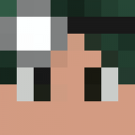

# McJty Website

The McJty Website.
Maker of RFTools, McJtyLib, Deep Resonance, and Gear Swapper.

<div align="center">
    
</div>

## Project Structure

The project is divided into two main parts:

- [**www**](./www): The main website and wiki.
- [**redirector**](./redirector): The redirector for the McJty website, which is used to redirect requests from the old wiki links to the new website.

## Setup

Make sure you have the correct Node.js version installed (v24).

This can be made easy by using [nvm](https://github.com/nvm-sh/nvm) (or on Windows [nvm-windows](https://github.com/coreybutler/nvm-windows)).

To set the correct node version:

```shell
nvm use
```

Ensure you have [pnpm](https://pnpm.io/) installed:

```shell
npm install -g pnpm
```

To install dependencies, run the following command in the root of the project:

```shell
pnpm install
```

## Formatting

To format all files in the project, run the following command in the root of the project:

```shell
pnpm format
```

## Running Commands

All commands for the sub projects are available in the root `package.json`.

To run a command in a sub project, use the following syntax:

```shell
pnpm www <command>
# or
pnpm redirector <command>
```

For example, to run the `dev` command in the `www` sub project, use:

```shell
pnpm www dev
```
