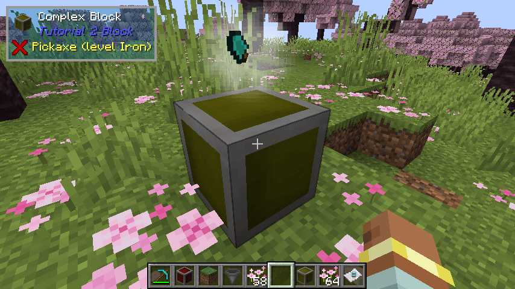

# Episode 2

## Links

* [Video](https://youtu.be/4IQLCHSoUN8)
* [Back to 1.20.4 Tutorial Index](./1.20.4_neo.md)
* [Tutorial GitHub](https://github.com/McJty/Tut4_2Block/tree/1.20.4_neo)

## Introduction

In this episode we will create a simple block and a more complex block with associated block entity.
We will learn the following things in this tutorial:

* Creation of a custom block and block entity
* Block entity renderer for fancy effect
* Simple usage of a particle system
* Capability for storing items
* Datagen for all the jsons
* Tags for blocks and items

We will also clean up the gradle and mod setup stuff a bit.

## The main mod class

In this tutorial we greatly simplified the main mod class. Most of the things we did here are now
done in other classes. We removed the client specific setup. This is now in a different file.
We moved all registration stuff to the Registration class. Finally we removed all things we don't
need right now.

```java
@Mod(Tutorial2Block.MODID)
public class Tutorial2Block {

    public static final String MODID = "tut2block";
    public static final Logger LOGGER = LogUtils.getLogger();

    public Tutorial2Block(IModBus modEventBus) {
        Registration.init(modEventBus);

        modEventBus.addListener(this::commonSetup);
        modEventBus.addListener(Registration::addCreative);
        modEventBus.addListener(DataGeneration::generate);
    }

    private void commonSetup(final FMLCommonSetupEvent event) {
    }
}
```

## Registration

Everything related to registration has moved to the `Registration` class. We define three
deferred registers here: one for blocks, one for items and one for block entities. We then
go on to define a simple block with associated item and a complex block with associated
item and block entity. The `init` method is called from the main mod class to register
the deferred registers.

Finally, the `addCreative` method is added to the mod event bus to add the blocks to the
creative tabs.

```java
public class Registration {

    public static final DeferredRegister.Blocks BLOCKS = DeferredRegister.createBlocks(Tutorial2Block.MODID);
    public static final DeferredRegister.Items ITEMS = DeferredRegister.createItems(Tutorial2Block.MODID);
    public static final DeferredRegister<BlockEntityType<?>> BLOCK_ENTITIES = DeferredRegister.create(BuiltInRegistries.BLOCK_ENTITY_TYPE, Tutorial2Block.MODID);

    public static final DeferredBlock<SimpleBlock> SIMPLE_BLOCK = BLOCKS.register("simple_block", SimpleBlock::new);
    public static final DeferredItem<Item> SIMPLE_BLOCK_ITEM = ITEMS.register("simple_block", () -> new BlockItem(SIMPLE_BLOCK.get(), new Item.Properties()));

    public static final DeferredBlock<ComplexBlock> COMPLEX_BLOCK = BLOCKS.register("complex_block", ComplexBlock::new);
    public static final DeferredItem<Item> COMPLEX_BLOCK_ITEM = ITEMS.register("complex_block", () -> new BlockItem(COMPLEX_BLOCK.get(), new Item.Properties()));
    public static final Supplier<BlockEntityType<ComplexBlockEntity>> COMPLEX_BLOCK_ENTITY = BLOCK_ENTITIES.register("complex_block",
            () -> BlockEntityType.Builder.of(ComplexBlockEntity::new, COMPLEX_BLOCK.get()).build(null));

    public static void init(IEventBus modEventBus) {
        BLOCKS.register(modEventBus);
        ITEMS.register(modEventBus);
        BLOCK_ENTITIES.register(modEventBus);
    }

    static void addCreative(BuildCreativeModeTabContentsEvent event) {
        if (event.getTabKey() == CreativeModeTabs.BUILDING_BLOCKS) {
            event.accept(SIMPLE_BLOCK_ITEM);
            event.accept(COMPLEX_BLOCK_ITEM);
        }
    }
}
```

## Simple block

Let's first discuss the simple block. This is a block that doesn't have a block entity but it
does have some special features. Let's look at the code first. In the constructor
we define a block with a strength of 3.5 (that influences how long it takes for a pickaxe
to actually break the block), we require the correct tool for drops and we enable random ticks.

:::info Note
The tool that is required to harvest this is defined with tags. More on that later in this
tutorial.
:::

Because we specified random ticks we need to override the `randomTick` method. This method is
called every random tick. In this case we send some smoke particles at the top of the block.

Finally, we override the `use` method. This method is called when the player right clicks on
the block. In this case we check if we are on the client side. If so we explode the block
and return `InteractionResult.SUCCESS` to indicate that we handled the interaction. If we
are on the server side we return `InteractionResult.PASS` to indicate that we didn't handle
the interaction.

```java
public class SimpleBlock extends Block {

    public SimpleBlock() {
        // Let our block behave like a metal block
        super(Properties.of()
                .strength(3.5F)
                .requiresCorrectToolForDrops()
                .sound(SoundType.METAL)
                .randomTicks());
    }

    @Override
    public void randomTick(BlockState state, ServerLevel level, BlockPos pos, RandomSource random) {
        level.sendParticles(ParticleTypes.SMOKE, pos.getX() + .5, pos.getY() + 1.5, pos.getZ() + .5, 10, 0, 0, 0, 0.15);
    }

    @Override
    public InteractionResult use(BlockState state, Level level, BlockPos pos, Player player, InteractionHand hand, BlockHitResult result) {
        if (level.isClientSide) {
            level.explode(null, pos.getX() + .5, pos.getY() + .5, pos.getZ() + .5, 2f, false, Level.ExplosionInteraction.MOB);
            return InteractionResult.SUCCESS;
        }
        return InteractionResult.PASS;
    }
}
```

That's all there is to it. Later when we talk about data generation we will show how we define
the model, the loot table, a recipe and the tags for this block.

## Complex block

The complex block is a block that has a block entity. The block entity is used to store one item
and also to render a fancy effect. Let's first look at the block class.

Remember our previous tutorial. There we talked about definitions and how there is only one of
each type of Block in the game. That's why you cannot store any data in the block class because
it is shared between all instances of the block. That's why we need a block entity. The block
entity is created for each instance of the block in the world. This means that we can store
data in the block entity and it will be unique for each instance. In addition block entities
also allow us to perform certain actions every tick. With a block you can only do scheduled
or random ticks.



### The block class

The constructor is similar to the simple block.

Because we have an associated block entity with our block we need to implement the `EntityBlock`
interface. This interface has two methods that we need to implement. The first method is
`newBlockEntity`. This method is called when the block is placed in the world. It is used to
create the block entity. The second method is `getTicker`. This method is called when the block
entity is created. It is used to create a `BlockEntityTicker` that can be used to perform
certain actions every tick. In this case we return `null` for the client side because we don't
need a ticker there. On the server side we return a ticker that will delegate to the block
entity. By doing it like this we know that our block will only tick on the server side.

:::info Note
Ticks occur 20 times per second (under normal load) and they happen both client and server side.
:::

```java
public class ComplexBlock extends Block implements EntityBlock {

    public ComplexBlock() {
        // Let our block behave like a metal block
        super(BlockBehaviour.Properties.of()
                .strength(3.5F)
                .requiresCorrectToolForDrops()
                .sound(SoundType.METAL));
    }

    // Our block has an associated block entity. This method from EntityBlock is used to create that block entity
    @Nullable
    @Override
    public BlockEntity newBlockEntity(BlockPos pos, BlockState state) {
        return new ComplexBlockEntity(pos, state);
    }

    // This method is used to create a BlockEntityTicker for our block entity. This ticker can be used to perform certain actions every tick
    @Nullable
    @Override
    public <T extends BlockEntity> BlockEntityTicker<T> getTicker(Level level, BlockState state, BlockEntityType<T> type) {
        if (level.isClientSide) {
            // We don't have anything to do on the client side
            return null;
        } else {
            // Server side we delegate ticking to our block entity
            return (lvl, pos, st, blockEntity) -> {
                if (blockEntity instanceof ComplexBlockEntity be) {
                    be.tickServer();
                }
            };
        }
    }
}
```

### The Block Entity class

The block entity class is where the magic happens. We are going to go over this code in parts. First
start with a few constants. We define a tag name for the items that we store in the block entity (more
on that later). We also define the number of slots that we have and the index of the slot that we use.
This block will have an inventory of only one slot.

#### Capabilities

To represent our items we use a **capability**. Capabilities are a way to attach additional behaviour
to an object. In this case we attach an inventory to our block entity. Capabilities can also be
attached to other objects like entities, itemstacks, chunks, etc. By using capabilities we can
ensure that our block will work correctly with other mods that also use capabilities.

The capability that we use in this block is the `IItemHandler` capability. This capability is
used to represent an inventory. We use the `Lazy` class to create a lazy reference to
the capability. By using this you can delay the actual creation of the capability instance
until it is actually needed. This is useful because the capability might not be needed at all.
In this tutorial we are guaranteed to always need the items so that's why we do a direct
declaration of the item stack handler (`items` variable). This variable allows us to access
the items in a more optimal and convenient way.

Note that NeoForge also provides energy and fluid capabilities. In addition, mods can also define
their own capabilities if needed.

For our item handler we use the standard NeoForge item stack handler (`ItemStackHandler`).
This class is a convenient way to store a list of items. It also has methods to serialize
and deserialize the items (we will use that later). We override the `onContentsChanged` method to mark the block entity as
changed when the contents of the item handler change. This is needed so that the block entity
will be saved to disk.

Because we also need to tell the client that the block entity has changed we also send a block
update to the client. Later on the client we will listen for this and update the block entity.

Our capability has to be registered. For this we add the following to the main mod class:

```java
public Tutorial2Block(IModBus modEventBus) {
    ...
    modEventBus.addListener(this::registerCapabilities);
}

private void registerCapabilities(RegisterCapabilitiesEvent event) {
    event.registerBlockEntity(Capabilities.ItemHandler.BLOCK, Registration.COMPLEX_BLOCK_ENTITY.get(), (o, direction) -> o.getItemHandler());
}

```

And here is the full block entity:

```java
public class ComplexBlockEntity extends BlockEntity {

    public static final String ITEMS_TAG = "Inventory";

    public static int SLOT_COUNT = 1;
    public static int SLOT = 0;

    private final ItemStackHandler items = createItemHandler();
    private final Lazy<IItemHandler> itemHandler = Lazy.of(() -> items);

    public ComplexBlockEntity(BlockPos pos, BlockState state) {
        super(COMPLEX_BLOCK_ENTITY.get(), pos, state);
    }

    @Nonnull
    private ItemStackHandler createItemHandler() {
        return new ItemStackHandler(SLOT_COUNT) {
            @Override
            protected void onContentsChanged(int slot) {
                setChanged();
                level.sendBlockUpdated(worldPosition, getBlockState(), getBlockState(), Block.UPDATE_ALL);
            }
        };
    }

    public IItemHandler getItemHandler() {
        return itemHandler.get();
    }
}
```

#### Saving and Loading

Now some more code. This code is responsible for saving and loading the block entity. We seperate
the saving and loading of the inventory itself to a separate method since we will need that for
server to client synchronization as well.

NBT (represented by the `CompoundTag` class) is a way to store data to disk. It's a hierarchical
structure that can contain other tags. The `CompoundTag` class is basically a map of string keys to tags.
Tags can be of different types like `StringTag`, `IntTag`, `ListTag`, etc.

:::info Tip!
A common misconception is that blocks contain NBT in memory. This is not true. NBT is a serialization
format that is used to store data to disk. In memory a block entity is just a class with fields.
The only exception where NBT is used in memory is with itemstacks.
:::

:::danger Warning
Everytime you make a change to the block entity you need to call `setChanged` to mark the block
entity as changed. If you don't do this your changes will not be saved to disk and you will lose
them when the world is saved and reloaded.
:::

```java
    @Override
    protected void saveAdditional(CompoundTag tag) {
        super.saveAdditional(tag);
        saveClientData(tag);
    }

    private void saveClientData(CompoundTag tag) {
        tag.put(ITEMS_TAG, items.serializeNBT());
    }

    @Override
    public void load(CompoundTag tag) {
        super.load(tag);
        loadClientData(tag);
    }

    private void loadClientData(CompoundTag tag) {
        if (tag.contains(ITEMS_TAG)) {
            items.deserializeNBT(tag.getCompound(ITEMS_TAG));
        }
    }
```

#### Server to Client synchronization

Because we want to synchronize the block entity from the server to the client (for rendering) we need to
override a few methods. The `getUpdateTag` and `handleUpdateTag` methods are used whenever a
new chunk is loaded. `getUpdateTag` is called server side and creates a tag that is sent to the client.
It's important to keep this tag as small as possible (network overhead) so we only send the data that
is really needed. That's why we made the `saveClientData` method.

The `getUpdatePacket` and `onDataPacket` methods are used whenever a block update happens. This is
used to notify the client that a block has changed. This is used for example when a blockstate changes
or when a block is explicitly marked as changed by the server. In our case we use this to notify the
client that the inventory has changed. We use the `ClientboundBlockEntityDataPacket` class to create
a packet that contains the data we want to send to the client. We use the `saveClientData` method
to save the data to the packet. On the client side we use the `onDataPacket` method to load the data
from the packet. We use the `loadClientData` method to load the data from the packet.
Note that ClientboundBlockEntityDataPacket.create(this) actually uses `getUpdateTag` to create the packet.

:::info Note!
Be aware that even in single player we use networking to communicate information from server to
client and vice versa.
:::

```java
    // The getUpdateTag()/handleUpdateTag() pair is called whenever the client receives a new chunk
    // it hasn't seen before. i.e. the chunk is loaded
    @Override
    public CompoundTag getUpdateTag() {
        CompoundTag tag = super.getUpdateTag();
        saveClientData(tag);
        return tag;
    }

    @Override
    public void handleUpdateTag(CompoundTag tag) {
        if (tag != null) {
            loadClientData(tag);
        }
    }

    // The getUpdatePacket()/onDataPacket() pair is used when a block update happens on the client
    // (a blockstate change or an explicit notificiation of a block update from the server). It's
    // easiest to implement them based on getUpdateTag()/handleUpdateTag()
    @Nullable
    @Override
    public ClientboundBlockEntityDataPacket getUpdatePacket() {
        return ClientboundBlockEntityDataPacket.create(this);
    }

    @Override
    public void onDataPacket(Connection net, ClientboundBlockEntityDataPacket pkt) {
        // This is called client side
        CompoundTag tag = pkt.getTag();
        // This will call loadClientData()
        if (tag != null) {
            handleUpdateTag(tag);
        }
    }
```

#### Block Entity Logic

Finally we actually need to give some logic to our block entity. In this case we want to
increase the durability of the item in the inventory every second. If the durability reaches
maximum we eject the item from the block entity.

We use `level.getGameTime()` to get the current game time. This is a counter that is increased
every tick. We use the modulo operator (`%`) to check if the current game time is a multiple
of 20 (20 ticks = 1 second). If it is we get the itemstack from the inventory and check if it
is damageable. If it is we decrease the damage value by 1. If the damage value reaches 0 we
eject the item from the block entity.

Note that `tickServer` is called from our block (ticker) class.

```java
    public void tickServer() {
        if (level.getGameTime() % 20 == 0) {
            ItemStack stack = items.getStackInSlot(SLOT);
            if (!stack.isEmpty()) {
                if (stack.isDamageableItem()) {
                    // Increase durability of item
                    int value = stack.getDamageValue();
                    if (value > 0) {
                        stack.setDamageValue(value - 1);
                    } else {
                        ejectItem();
                    }
                } else {
                    ejectItem();
                }
            }
        }
    }

    private void ejectItem() {
        BlockPos pos = worldPosition.relative(Direction.UP);
        Block.popResource(level, pos, items.extractItem(SLOT, 1, false));
    }
```

### Rendering

Besides the visuals of the block itself (which we will cover later in the datagen chapter) we
also want an additional visual for the block entity. In this case we want to render the item
in the inventory on top of the block.

When implementing a visual of a block there are basically two major types of rendering:

* A static model. This is the default and preferred way to render a block. You create a json model (using datagen or otherwise). It's also possible to do more complex and dynamic static models using baked models
* Dynamic rendering. This is used when you want to render something that is not possible with a static model. Usually this is when you want to do animation or other effects

In general you should always try to use a static model if possible. It's much more efficient and
easier to implement. In this example we need to use a dynamic `BlockEntityRenderer` because we
want to animate the rendering of the item in the inventory.

The `LIGHT` resource location represents the location of the texture we want to use as a special
glow effect. Note that because this texture is located in the `textures/block` folder we don't
need to stitch it to the atlas because this is done automatically for all textures in this folder.
More on stitching textures in a future tutorial.

The `ComplexBlockRenderer` class implements the `BlockEntityRenderer` interface. This interface
has one method `render` that is called every frame. In this method we fetch the `IItemHandler`
capability from the world for the block entity. This is done as an example of how to fetch
capabilities from a block entity. In this particular case we could also have added an api to
our block entity to access the item handler directly.

You are not supposed to use OpenGL directly in your rendering code. Instead you should use the
`MultiBufferSource` to get a `BufferBuilder` that you can use to render your model. The
`PoseStack` is used to transform the model. In this case we scale the model down to 50% and
move it to the center of the block. When `render` is called the `PoseStack` is already
translated to the correct position of the block entity. We use the current time to calculate
the angle of rotation of the item. `mulPose` is used to rotate the model around the y-axis.
Finally we render the model using the `ItemRenderer` and the `BufferBuilder` we got from the
`MultiBufferSource`.

:::info Note!
It is important to ALWAYS push and pop the `PoseStack` when you modify it. Otherwise you will
possibly corrupt the `PoseStack` of the caller of your `render` method and this can cause
weird rendering issues. The `PoseStack` is a stack of matrices. When you push a matrix you
create a copy of the current matrix and push it on the stack. When you pop a matrix you
restore the matrix from the top of the stack.
:::

In addition to the rendering of the item we also want to render a special glow effect. This
effect is rendered by rendering a billboard (a quad that always faces the player) with a
special texture. The texture is a series of 16x16 textures with a white circle in the middle and a
transparent background. This texture has an associated mcmeta file that tells Minecraft to
animate the texture by selecting a different texture every few frames.

The `renderBillboardQuadBright` method is responsible for rendering a quad that always faces
the player. It does this by manipulating the `PoseStack` so that it faces the player. It then
renders a quad with the given texture.

This method uses the translucent render type. This is a special render type that is used for
translucent textures. It is important to use this render type for translucent textures because
otherwise the textures will not render correctly.

```java
public class ComplexBlockRenderer implements BlockEntityRenderer<ComplexBlockEntity> {

    public static final ResourceLocation LIGHT = new ResourceLocation(Tutorial2Block.MODID, "block/light");

    public ComplexBlockRenderer(BlockEntityRendererProvider.Context context) {
    }

    @Override
    public void render(ComplexBlockEntity be, float partialTicks, PoseStack poseStack, MultiBufferSource bufferSource, int combinedLight, int combinedOverlay) {
        IItemHandler h = be.getLevel().getCapability(Capabilities.ItemHandler.BLOCK, be.getBlockPos(), null);
        if (h != null) {
            ItemStack stack = h.getStackInSlot(ComplexBlockEntity.SLOT);
            if (!stack.isEmpty()) {
                ItemRenderer itemRenderer = Minecraft.getInstance().getItemRenderer();
                long millis = System.currentTimeMillis();

                poseStack.pushPose();
                poseStack.pushPose();
                poseStack.scale(.5f, .5f, .5f);
                poseStack.translate(1f, 2.8f, 1f);
                float angle = ((millis / 45) % 360);
                poseStack.mulPose(Axis.YP.rotationDegrees(angle));
                itemRenderer.renderStatic(stack, ItemDisplayContext.FIXED, LightTexture.FULL_BRIGHT, combinedOverlay, poseStack, bufferSource, Minecraft.getInstance().level, 0);
                poseStack.popPose();

                poseStack.translate(0, 0.5f, 0);
                renderBillboardQuadBright(poseStack, bufferSource.getBuffer(RenderType.translucent()), 0.5f, LIGHT);
                poseStack.popPose();
            }
        }
    }

    private static void renderBillboardQuadBright(PoseStack matrixStack, VertexConsumer builder, float scale, ResourceLocation texture) {
        int b1 = LightTexture.FULL_BRIGHT >> 16 & 65535;
        int b2 = LightTexture.FULL_BRIGHT & 65535;
        TextureAtlasSprite sprite = Minecraft.getInstance().getTextureAtlas(InventoryMenu.BLOCK_ATLAS).apply(texture);
        matrixStack.pushPose();
        matrixStack.translate(0.5, 0.95, 0.5);
        Quaternionf rotation = Minecraft.getInstance().gameRenderer.getMainCamera().rotation();
        matrixStack.mulPose(rotation);
        Matrix4f matrix = matrixStack.last().pose();
        builder.vertex(matrix, -scale, -scale, 0.0f).color(255, 255, 255, 255).uv(sprite.getU0(), sprite.getV0()).uv2(b1, b2).normal(1, 0, 0).endVertex();
        builder.vertex(matrix, -scale, scale, 0.0f).color(255, 255, 255, 255).uv(sprite.getU0(), sprite.getV1()).uv2(b1, b2).normal(1, 0, 0).endVertex();
        builder.vertex(matrix, scale, scale, 0.0f).color(255, 255, 255, 255).uv(sprite.getU1(), sprite.getV1()).uv2(b1, b2).normal(1, 0, 0).endVertex();
        builder.vertex(matrix, scale, -scale, 0.0f).color(255, 255, 255, 255).uv(sprite.getU1(), sprite.getV0()).uv2(b1, b2).normal(1, 0, 0).endVertex();
        matrixStack.popPose();
    }
}
```

We also need to register the renderer. To do this we make a new `ClientSetup` class.
This class is annotated with `@Mod.EventBusSubscriber` to tell NeoForge that it should
register this class to the event bus. The `bus` parameter tells NeoForge which event bus
to use (the mod bus in this case). The `value` parameter tells NeoForge that this class should only be registered
on the client side. This is important because the `EntityRenderersEvent.RegisterRenderers` is
only fired on the client side.

By doing this registration we tell Minecraft that whenever a block entity of type
`ComplexBlockEntity` is rendered it should use the `ComplexBlockRenderer` to render it (in addition
to rendering the block itself).

```java
@Mod.EventBusSubscriber(modid = MODID, bus = Mod.EventBusSubscriber.Bus.MOD, value = Dist.CLIENT)
public class ClientSetup {

    @SubscribeEvent
    public static void initClient(EntityRenderersEvent.RegisterRenderers event) {
        event.registerBlockEntityRenderer(Registration.COMPLEX_BLOCK_ENTITY.get(), ComplexBlockRenderer::new);
    }
}
```

### Data generation

In Minecraft al lot of things are represented in json files. This includes block models,
blockstates, item models, recipes, loot tables, advancements, etc. It's possible to create these
files by hand but when you have a larger mod this quickly becomes tedious. Datagen is also based
on an event called `GatherDataEvent`. Here you see how it is used.

From the main mod class we add this to the mod event bus using `addListener`.

All generated jsons are put in a folder called `generated/resources`. This folder is automatically
added to the classpath when running the game in the development environment. This means that
Minecraft will be able to find the jsons and use them. When building the mod the jsons are
automatically copied to the `resources` folder in the jar file. You can still put hand
written jsons in the `resources` folder and they will be used instead of the generated ones
(or in addition to them).

To actually do the generation you have to run the `runData` gradle task.

:::danger Warning!
Do not edit generated jsons! They will be overwritten the next time you do the runData
task again.
:::


```java
public class DataGeneration {

    public static void generate(GatherDataEvent event) {
        DataGenerator generator = event.getGenerator();
        PackOutput packOutput = generator.getPackOutput();
        CompletableFuture<HolderLookup.Provider> lookupProvider = event.getLookupProvider();

        generator.addProvider(event.includeClient(), new TutBlockStates(packOutput, event.getExistingFileHelper()));
        generator.addProvider(event.includeClient(), new TutItemModels(packOutput, event.getExistingFileHelper()));
        generator.addProvider(event.includeClient(), new TutLanguageProvider(packOutput, "en_us"));

        TutBlockTags blockTags = new TutBlockTags(packOutput, lookupProvider, event.getExistingFileHelper());
        generator.addProvider(event.includeServer(), blockTags);
        generator.addProvider(event.includeServer(), new TutItemTags(packOutput, lookupProvider, blockTags, event.getExistingFileHelper()));
        generator.addProvider(event.includeServer(), new TutRecipes(packOutput));
        generator.addProvider(event.includeServer(), new LootTableProvider(packOutput, Collections.emptySet(),
                List.of(new LootTableProvider.SubProviderEntry(TutLootTables::new, LootContextParamSets.BLOCK))));
    }
}
```

#### Block states

The datagen block state provider is used to generate model and blockstate json files. The
`TutBlockStates` class is a subclass of `BlockStateProvider`. The constructor takes a `PackOutput`
and an `ExistingFileHelper`. The `PackOutput` is used to write the generated files to the correct
location. The `ExistingFileHelper` is used to check if a file already exists. This is useful
when you want your generated jsons to use existing (vanilla) files.

The `registerStatesAndModels` method is used to register the blockstates and models. In this
example we use the `simpleBlock` method to generate a model and blockstate for both our blocks.

```java
public class TutBlockStates extends BlockStateProvider {

    public TutBlockStates(PackOutput output, ExistingFileHelper exFileHelper) {
        super(output, Tutorial2Block.MODID, exFileHelper);
    }

    @Override
    protected void registerStatesAndModels() {
        simpleBlock(Registration.SIMPLE_BLOCK.get());
        simpleBlock(Registration.COMPLEX_BLOCK.get());
    }
}
```

#### Item models

Items also need models. In this tutorial these models are going to be very simple as they
only have to refer to the block models.

The `modLoc` function creates a `ResourceLocation` for this mod and the given path. This is how
we refer to the block models.

```java
public class TutItemModels extends ItemModelProvider {

    public TutItemModels(PackOutput output, ExistingFileHelper existingFileHelper) {
        super(output, Tutorial2Block.MODID, existingFileHelper);
    }

    @Override
    protected void registerModels() {
        withExistingParent(Registration.SIMPLE_BLOCK.getId().getPath(), modLoc("block/simple_block"));
        withExistingParent(Registration.COMPLEX_BLOCK.getId().getPath(), modLoc("block/complex_block"));
    }
}
```

#### Language provider

In code you typically only use language strings. These strings are then translated to the
correct language by the game. These translations are also handled in json files and here
is how you can generate them:

```java
public class TutLanguageProvider extends LanguageProvider {

    public TutLanguageProvider(PackOutput output, String locale) {
        super(output, Tutorial2Block.MODID, locale);
    }

    @Override
    protected void addTranslations() {
        add(Registration.SIMPLE_BLOCK.get(), "Simple Block");
        add(Registration.COMPLEX_BLOCK.get(), "Complex Block");
    }
}
```

#### Block tags

Minecraft uses tags to group blocks, items, biomes, and other things. These tags are also
stored in json files. The `TutBlockTags` class is a subclass of `BlockTagsProvider`. The
constructor takes a `PackOutput`, a `HolderLookup.Provider`, and an `ExistingFileHelper`.

In this tutorial we associate our two blocks with two vanilla tags:

* `minecraft:mineable/pickaxe` - This tag is used to determine if a block can be mined with a pickaxe.
* `minecraft:needs_iron_tool` - This tag is used to specify that a block needs at least an iron tool to be mined.

```java
public class TutBlockTags extends BlockTagsProvider {

    public TutBlockTags(PackOutput output, CompletableFuture<HolderLookup.Provider> lookupProvider, @Nullable ExistingFileHelper existingFileHelper) {
        super(output, lookupProvider, Tutorial2Block.MODID, existingFileHelper);
    }

    @Override
    protected void addTags(HolderLookup.Provider provider) {
        tag(BlockTags.MINEABLE_WITH_PICKAXE)
                .add(Registration.COMPLEX_BLOCK.get(), Registration.SIMPLE_BLOCK.get());
        tag(BlockTags.NEEDS_IRON_TOOL)
                .add(Registration.COMPLEX_BLOCK.get(), Registration.SIMPLE_BLOCK.get());
     }
}
```

#### Item tags

Item tags are also stored in json files. The `TutItemTags` class is a subclass of `ItemTagsProvider`.
The item tags provider needs an instance of the previously created block tags provider.

Since we don't currently associate any tags with our items this class is empty.

```java
public class TutItemTags extends ItemTagsProvider {

    public TutItemTags(PackOutput packOutput, CompletableFuture<HolderLookup.Provider> lookupProvider, BlockTagsProvider blockTags, ExistingFileHelper helper) {
        super(packOutput, lookupProvider, blockTags.contentsGetter(), Tutorial2Block.MODID, helper);
    }

    @Override
    protected void addTags(HolderLookup.Provider provider) {
    }
}
```

#### Recipes

Recipes are also stored in json files. The `TutRecipes` class is a subclass of `RecipeProvider`.
The constructor takes a `PackOutput`.

Recipe datagen can be used for all types of recipes. In this tutorial we generate both a shapeless
recipe for the simple block and a shaped recipe for the complex block.

For every recipe we need to specify a category. This is a custom string that is used to group
recipes in the recipe book. In this tutorial we use `RecipeCategory.MISC` for both recipes.

We also need to specify if the recipe is gated behind a specific advancement. In this tutorial
we use the `InventoryChangeTrigger` to check if the player has a diamond in their inventory.

Note that recipes can be based on items but also on tags. Tags are usually better because
it makes the recipe more flexible. For example, if you use a tag for the recipe input you
can use any item that is in that tag.

```java
public class TutRecipes extends RecipeProvider {

    public TutRecipes(PackOutput packOutput) {
        super(packOutput);
    }

    @Override
    protected void buildRecipes(RecipeOutput consumer) {
        ShapelessRecipeBuilder.shapeless(RecipeCategory.MISC, Registration.SIMPLE_BLOCK.get())
                .requires(ItemTags.DIRT)
                .requires(Tags.Items.GEMS_DIAMOND)
                .unlockedBy("has_diamond", InventoryChangeTrigger.TriggerInstance.hasItems(
                        ItemPredicate.Builder.item().of(Tags.Items.GEMS_DIAMOND).build()))
                .save(consumer);

        ShapedRecipeBuilder.shaped(RecipeCategory.MISC, Registration.COMPLEX_BLOCK.get())
                .pattern("dsd")
                .pattern("dxd")
                .pattern("ddd")
                .define('d', ItemTags.DIRT)
                .define('x', Tags.Items.GEMS_DIAMOND)
                .define('s', Items.STICK)
                .group("tutorial")
                .unlockedBy("has_diamond", InventoryChangeTrigger.TriggerInstance.hasItems(
                        ItemPredicate.Builder.item().of(Tags.Items.GEMS_DIAMOND).build()))
                .save(consumer);

    }
}
```

#### Loot tables

Loot tables are used to specify what items a block or entity drops when it is broken or killed.
The `TutLootTables` class is a subclass of `VanillaBlockLoot`. The reason we extend this class
is that we then get access to a lot of helper methods that makes it easier to generate loot tables.

For the simple block we use the `dropSelf` method. This method will make the block drop itself
when it is broken. For the complex block we use the `createStandardTable` method. This method
will generate a loot table that drops the block itself and the items that are in the block entity.
This is similar to how the shulker box works.

```java
public class TutLootTables extends VanillaBlockLoot {

    @Override
    protected void generate() {
        dropSelf(Registration.SIMPLE_BLOCK.get());
        createStandardTable(Registration.COMPLEX_BLOCK.get(), Registration.COMPLEX_BLOCK_ENTITY.get());
    }

    @Override
    protected Iterable<Block> getKnownBlocks() {
        return BuiltInRegistries.BLOCK.holders()
                .filter(e -> e.key().location().getNamespace().equals(Tutorial2Block.MODID))
                .map(Holder.Reference::value)
                .collect(Collectors.toList());
    }

    private void createStandardTable(Block block, BlockEntityType<?> type) {
        LootPool.Builder builder = LootPool.lootPool()
                .setRolls(ConstantValue.exactly(1))
                .add(LootItem.lootTableItem(block)
                        .apply(CopyNameFunction.copyName(CopyNameFunction.NameSource.BLOCK_ENTITY))
                        .apply(CopyNbtFunction.copyData(ContextNbtProvider.BLOCK_ENTITY)
                                .copy(ComplexBlockEntity.ITEMS_TAG, "BlockEntityTag." + ComplexBlockEntity.ITEMS_TAG, CopyNbtFunction.MergeStrategy.REPLACE))
                        .apply(SetContainerContents.setContents(type)
                                .withEntry(DynamicLoot.dynamicEntry(new ResourceLocation("minecraft", "contents"))))
                );
        add(block, LootTable.lootTable().withPool(builder));
    }
}
```