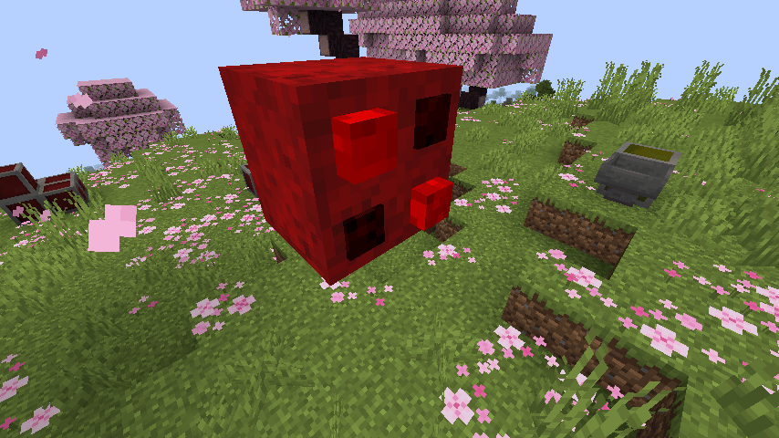
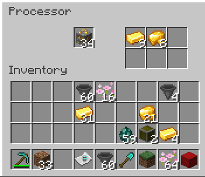

# Episode 3

## Links

* [Video](https://youtu.be/jE68rw_sAXg)
* [Back to 1.20.4 Tutorial Index](./1.20.4_neo.md)
* [Tutorial GitHub](https://github.com/McJty/Tut4_2Block/tree/1.20.4_neo)

## Introduction

This tutorial continues on the second tutorial and adds another more complex block. In this tutorial
we will learn the following things:

* Block properties
* User interface (GUI)
* Integration with other mods (The One Probe)
* Networking

## Block properties

Let's start by adding a new block (`ProcessorBlock`). We will add to this file in steps. First let's
define the block with associated block properties. We also need a block entity, so we'll add that too
(`newBlockEntity` and `getTicker` are for that).

With `createBlockStateDefinition` we define the block properties. We will use four boolean properties
to indicate whether a button is pressed or not. We will use these later to render the block.
In addition, we also add a standard `FACING` property to indicate the direction the block is facing.

The addition of these properties will cause our block to have a different blockstate for each
combination of these properties. That means that there will be a total of 16 times 6 = 96 different
blockstates. This is a good amount but not dramatic. It's ok for a block to have hundreds of
properties but don't overdo it. In the next tutorial we'll show a case where it is better to use
a different system.

The `getPlacementState` method is used to set the initial state of the block when it is placed.
In this case we set the `FACING` property to the direction the player is looking at and the
button properties to false.

Because our block is not fully opaque we need to define a shape for it. We do that with the
`getShape` method. We define a different shape for each direction. The shape is defined as a
`VoxelShape` which is a collection of boxes. In this case we define a box that is fit exactly
the shape we will define later in our model.

```java
public class ProcessorBlock extends Block implements EntityBlock {

    public static final BooleanProperty BUTTON00 = BooleanProperty.create("button00");
    public static final BooleanProperty BUTTON01 = BooleanProperty.create("button01");
    public static final BooleanProperty BUTTON10 = BooleanProperty.create("button10");
    public static final BooleanProperty BUTTON11 = BooleanProperty.create("button11");

    private static final VoxelShape SHAPE_DOWN = Shapes.box(0, 2.0/16, 0, 1, 1, 1);
    private static final VoxelShape SHAPE_UP = Shapes.box(0, 0, 0, 1, 14.0/16, 1);
    private static final VoxelShape SHAPE_NORTH = Shapes.box(0, 0, 2.0/16, 1, 1, 1);
    private static final VoxelShape SHAPE_SOUTH = Shapes.box(0, 0, 0, 1, 1, 14.0/16);
    private static final VoxelShape SHAPE_WEST = Shapes.box(2.0/16, 0, 0, 1, 1, 1);
    private static final VoxelShape SHAPE_EAST = Shapes.box(0, 0, 0, 14.0/16, 1, 1);

    public ProcessorBlock() {
        // Let our block behave like a metal block
        super(Properties.of()
                .strength(3.5F)
                .noOcclusion()
                .requiresCorrectToolForDrops()
                .sound(SoundType.METAL));
    }

    @Override
    public VoxelShape getShape(BlockState state, BlockGetter getter, BlockPos pos, CollisionContext context) {
        return switch (state.getValue(BlockStateProperties.FACING)) {
            case DOWN -> SHAPE_DOWN;
            case UP -> SHAPE_UP;
            case NORTH -> SHAPE_NORTH;
            case SOUTH -> SHAPE_SOUTH;
            case WEST -> SHAPE_WEST;
            case EAST -> SHAPE_EAST;
        };
    }

    @Nullable
    @Override
    public BlockEntity newBlockEntity(BlockPos pos, BlockState state) {
        return new ProcessorBlockEntity(pos, state);
    }

    @Nullable
    @Override
    public <T extends BlockEntity> BlockEntityTicker<T> getTicker(Level level, BlockState state, BlockEntityType<T> type) {
        if (level.isClientSide) {
            // We don't have anything to do on the client side
            return null;
        } else {
            // Server side we delegate ticking to our block entity
            return (lvl, pos, st, blockEntity) -> {
                if (blockEntity instanceof ProcessorBlockEntity be) {
                    be.tickServer();
                }
            };
        }
    }

    @Nullable
    @Override
    public BlockState getStateForPlacement(BlockPlaceContext context) {
        return this.defaultBlockState()
                .setValue(BlockStateProperties.FACING, context.getNearestLookingDirection().getOpposite())
                .setValue(BUTTON00, false)
                .setValue(BUTTON01, false)
                .setValue(BUTTON10, false)
                .setValue(BUTTON11, false);
    }

    @Override
    protected void createBlockStateDefinition(StateDefinition.Builder<Block, BlockState> builder) {
        builder.add(BlockStateProperties.FACING, BUTTON00, BUTTON01, BUTTON10, BUTTON11);
    }
}
```

## BlockState datagen

We want our block to look like this:



So basically it's a block with four buttons. The buttons can be pressed or not.

Let's first concentrate on the rendering of this block. We will use a static json model for this and
we want to use datagen. So let's look at `TutBlockStates`. Basically we add a new `registerProcessor`
method. That method will first make the base model, and then it will make a multi-part model for
all the buttons in all their possible states. The base model is a simple cube with a texture on all
sides. Using the vanilla multipart system it is possible to make our model conditional. That means
that all the button models are only added if the corresponding button is pressed. This is done
by examining the blockstate properties.

```java
public class TutBlockStates extends BlockStateProvider {

    @Override
    protected void registerStatesAndModels() {
        ...
        registerProcessor();
    }

    private void registerProcessor() {
        RegistryObject<ProcessorBlock> processor = Registration.PROCESSOR_BLOCK;
        String path = "processor";

        BlockModelBuilder base = models().getBuilder("block/" + path + "_main");
        base.parent(models().getExistingFile(mcLoc("cube")));

        base.element()
                .from(0f, 0f, 0f)
                .to(16f, 14f, 16f)
                .allFaces((direction, faceBuilder) -> faceBuilder.texture("#txt"))
                .end();

        base.texture("txt", modLoc("block/processor_main"));
        base.texture("particle", modLoc("block/processor_main"));

        base.renderType("solid");

        createProcessorModel(processor.get(), path, base);
    }

    private void createProcessorModel(Block block, String path, BlockModelBuilder frame) {
        BlockModelBuilder singleOff00 = buttonBuilderOff(path, "singleoff00", 2, 14, 2);
        BlockModelBuilder singleOn00 = buttonBuilderOn(path, "singleon00", 2, 14, 2);
        BlockModelBuilder singleOff10 = buttonBuilderOff(path, "singleoff10", 10, 14, 2);
        BlockModelBuilder singleOn10 = buttonBuilderOn(path, "singleon10", 10, 14, 2);
        BlockModelBuilder singleOff01 = buttonBuilderOff(path, "singleoff01", 2, 14, 10);
        BlockModelBuilder singleOn01 = buttonBuilderOn(path, "singleon01", 2, 14, 10);
        BlockModelBuilder singleOff11 = buttonBuilderOff(path, "singleoff11", 10, 14, 10);
        BlockModelBuilder singleOn11 = buttonBuilderOn(path, "singleon11", 10, 14, 10);

        MultiPartBlockStateBuilder bld = getMultipartBuilder(block);

        // For all six directions we add models that are rotated accordingly
        for (Direction dir : Direction.values()) {
            int angleOffset = dir.getAxis().isVertical() ? 0 : (((int) dir.toYRot()) + 180) % 360;
            int rotationX = dir == Direction.DOWN ? 180 : dir.getAxis().isHorizontal() ? 90 : 0;
            // Add the base model
            bld.part().modelFile(frame).rotationX(rotationX).rotationY(angleOffset).addModel().condition(BlockStateProperties.FACING, dir).end();
            // Add all the button models conditionally for this orientation. Both the 'off' and the 'on' state
            bld.part().modelFile(singleOff00).rotationX(rotationX).rotationY(angleOffset).addModel().condition(BlockStateProperties.FACING, dir).condition(ProcessorBlock.BUTTON00, false);
            bld.part().modelFile(singleOn00).rotationX(rotationX).rotationY(angleOffset).addModel().condition(BlockStateProperties.FACING, dir).condition(ProcessorBlock.BUTTON00, true);
            bld.part().modelFile(singleOff10).rotationX(rotationX).rotationY(angleOffset).addModel().condition(BlockStateProperties.FACING, dir).condition(ProcessorBlock.BUTTON10, false);
            bld.part().modelFile(singleOn10).rotationX(rotationX).rotationY(angleOffset).addModel().condition(BlockStateProperties.FACING, dir).condition(ProcessorBlock.BUTTON10, true);
            bld.part().modelFile(singleOff01).rotationX(rotationX).rotationY(angleOffset).addModel().condition(BlockStateProperties.FACING, dir).condition(ProcessorBlock.BUTTON01, false);
            bld.part().modelFile(singleOn01).rotationX(rotationX).rotationY(angleOffset).addModel().condition(BlockStateProperties.FACING, dir).condition(ProcessorBlock.BUTTON01, true);
            bld.part().modelFile(singleOff11).rotationX(rotationX).rotationY(angleOffset).addModel().condition(BlockStateProperties.FACING, dir).condition(ProcessorBlock.BUTTON11, false);
            bld.part().modelFile(singleOn11).rotationX(rotationX).rotationY(angleOffset).addModel().condition(BlockStateProperties.FACING, dir).condition(ProcessorBlock.BUTTON11, true);
        }
    }

    private BlockModelBuilder buttonBuilderOn(String path, String name, int x, int y, int z) {
        return models().getBuilder("block/" + path + "/" + name)
                .element()
                .from(x, y, z)
                .to(x+4, y+2, z+4)
                .allFaces((direction, faceBuilder) -> faceBuilder.texture("#button"))
                .end()
                .texture("button", modLoc("block/processor_on"));
    }

    private BlockModelBuilder buttonBuilderOff(String path, String name, int x, int y, int z) {
        return models().getBuilder("block/" + path + "/" + name)
                .element()
                .from(x, y, z)
                .to(x+4, y+.5f, z+4)
                .allFaces((direction, faceBuilder) -> faceBuilder.texture("#button"))
                .end()
                .texture("button", modLoc("block/processor_off"));
    }
}
```

We also need to add an entry for the item:

```java
public class TutItemModels extends ItemModelProvider {

    ...

    @Override
    protected void registerModels() {
        ...
        withExistingParent(Registration.PROCESSOR_BLOCK.getId().getPath(), modLoc("block/processor_main"));
    }
}
```

When you generate this you'll get a lot of models. You can see them in the `generated` folder.

## The Block Entity

Let's start with the basics for our block entity. This is similar to the complex block entity from
the previous tutorial. In this example we have 1 input slot and 6 output slots. We also have
sided access. The output slots are only accessible from the bottom. The input slot is only accessible
from the other sides. When no side is specified we return the base item handler.

The input and output handlers are separate fields. However, we have three lazy optional item handlers
because we want to return a combined item handler in case the capability is requested with null side.
The NeoForge `CombinedInvWrapper` is a wrapper around multiple item handlers that makes them appear as
a single item handler.

We define our own `AdaptedItemHandler` that allows us to adapt an existing item handler and restrict
the operations that are allowed. For example the input item handler only allows insertion and the
output item handler only allows extraction.

The reason we don't restrict these operations in the item handler itself is that we want to be able
to use `inputItems` and `outputItems` unrestricted in our block entity. The restriction is only
for automation (like hoppers).

```java
public class ProcessorBlockEntity extends BlockEntity {

    public static final int SLOT_INPUT = 0;
    public static final int SLOT_INPUT_COUNT = 1;

    public static final int SLOT_OUTPUT = 0;
    public static final int SLOT_OUTPUT_COUNT = 6;

    public static final int SLOT_COUNT = SLOT_INPUT_COUNT + SLOT_OUTPUT_COUNT;

    private final ItemStackHandler inputItems = createItemHandler(SLOT_INPUT_COUNT);
    private final ItemStackHandler outputItems = createItemHandler(SLOT_OUTPUT_COUNT);
    private final Lazy<IItemHandler> itemHandler = Lazy.of(() -> new CombinedInvWrapper(inputItems, outputItems));
    private final Lazy<IItemHandler> inputItemHandler = Lazy.of(() -> new AdaptedItemHandler(inputItems) {
        @Override
        public @NotNull ItemStack extractItem(int slot, int amount, boolean simulate) {
            return ItemStack.EMPTY;
        }
    });
    private final Lazy<IItemHandler> outputItemHandler = Lazy.of(() -> new AdaptedItemHandler(outputItems) {
        @Override
        public @NotNull ItemStack insertItem(int slot, @NotNull ItemStack stack, boolean simulate) {
            return stack;
        }
    });

    public ProcessorBlockEntity(BlockPos pos, BlockState state) {
        super(Registration.PROCESSOR_BLOCK_ENTITY.get(), pos, state);
    }

    public ItemStackHandler getInputItems() {
        return inputItems;
    }

    public ItemStackHandler getOutputItems() {
        return outputItems;
    }

    public Lazy<IItemHandler> getItemHandler() {
        return itemHandler;
    }

    public Lazy<IItemHandler> getInputItemHandler() {
        return inputItemHandler;
    }

    public Lazy<IItemHandler> getOutputItemHandler() {
        return outputItemHandler;
    }

    @Nonnull
    private ItemStackHandler createItemHandler(int slots) {
        return new ItemStackHandler(slots) {
            @Override
            protected void onContentsChanged(int slot) {
                setChanged();
            }
        };
    }

    @Override
    protected void saveAdditional(CompoundTag tag) {
        super.saveAdditional(tag);
        tag.put(ITEMS_INPUT_TAG, inputItems.serializeNBT());
        tag.put(ITEMS_OUTPUT_TAG, outputItems.serializeNBT());
    }

    @Override
    public void load(CompoundTag tag) {
        super.load(tag);
        if (tag.contains(ITEMS_INPUT_TAG)) {
            inputItems.deserializeNBT(tag.getCompound(ITEMS_INPUT_TAG));
        }
        if (tag.contains(ITEMS_OUTPUT_TAG)) {
            outputItems.deserializeNBT(tag.getCompound(ITEMS_OUTPUT_TAG));
        }
    }
}
```

We also have to register this capability in the main class. Note how we return another
capability depending on the direction:

```java
    private void registerCapabilities(RegisterCapabilitiesEvent event) {
        ...
        event.registerBlockEntity(Capabilities.ItemHandler.BLOCK, Registration.PROCESSOR_BLOCK_ENTITY.get(), (o, direction) -> {
            if (direction == null) {
                return o.getItemHandler().get();
            }
            if (direction == Direction.DOWN) {
                return o.getOutputItemHandler().get();
            }
            return o.getInputItemHandler().get();
        });
    }

```

We also need a new tool class (`AdaptedItemHandler`) to help us with the item handler. This is basically
a wrapper around the `ItemStackHandler` that allows us to restrict the operations that are allowed
on another item handler. The only thing this class does is delegate all operations to the wrapped
item handler.

```java
public class AdaptedItemHandler implements IItemHandlerModifiable {

    private final IItemHandlerModifiable handler;

    public AdaptedItemHandler(IItemHandlerModifiable handler) {
        this.handler = handler;
    }

    @Override
    public void setStackInSlot(int slot, @NotNull ItemStack stack) {
        handler.setStackInSlot(slot, stack);
    }

    @Override
    public int getSlots() {
        return handler.getSlots();
    }

    @Override
    public @NotNull ItemStack getStackInSlot(int slot) {
        return handler.getStackInSlot(slot);
    }

    @Override
    public @NotNull ItemStack insertItem(int slot, @NotNull ItemStack stack, boolean simulate) {
        return handler.insertItem(slot, stack, simulate);
    }

    @Override
    public @NotNull ItemStack extractItem(int slot, int amount, boolean simulate) {
        return handler.extractItem(slot, amount, simulate);
    }

    @Override
    public int getSlotLimit(int slot) {
        return handler.getSlotLimit(slot);
    }

    @Override
    public boolean isItemValid(int slot, @NotNull ItemStack stack) {
        return handler.isItemValid(slot, stack);
    }
}
```

## Registration

We also need to add code to register our block and block entity:

```java
public class Registration {

    ...
    public static final DeferredBlock<ProcessorBlock> PROCESSOR_BLOCK = BLOCKS.register("processor_block", ProcessorBlock::new);
    public static final DeferredItem<Item> PROCESSOR_BLOCK_ITEM = ITEMS.register("processor_block", () -> new BlockItem(PROCESSOR_BLOCK.get(), new Item.Properties()));
    public static final Supplier<BlockEntityType<ProcessorBlockEntity>> PROCESSOR_BLOCK_ENTITY = BLOCK_ENTITIES.register("processor_block",
            () -> BlockEntityType.Builder.of(ProcessorBlockEntity::new, PROCESSOR_BLOCK.get()).build(null));

    ...
    static void addCreative(BuildCreativeModeTabContentsEvent event) {
        if (event.getTabKey() == CreativeModeTabs.BUILDING_BLOCKS) {
            ...
            event.accept(PROCESSOR_BLOCK_ITEM);
        }
    }
```

## User interface

Before we continue with the rest of the block entity functionality, let's first talk about the user
interface for this block. We want a user interface that looks like this:



User interfaces in Minecraft are a bit more complicated since they have both a client side
and a server side component. The class that ties both sides together is a container represented
by `AbstractContainerMenu`. This is the class that is responsible for sending the data from the server
to the client and back. The client side is represented by a `Screen` class. This is the class that
is responsible for rendering the user interface and sending the user input back to the server.

### Container

Let's start with the container. We need to create a new class that extends `AbstractContainerMenu`.

In the container we need to add the slots that we want to show in the user interface. In our case
we want to show slots from three inventories: the input inventory, the output inventory and the player.
Every slot has a source inventory and a slot index. It also has an actual location on the screen.

A very important function that you have to override in a container is `quickMoveStack`. This function
is called when the player shift-clicks on a slot. It is responsible for moving the item to a sensible
place depending on the context. For example, in our case we want to move items from the player inventory
to the input slot and from the output slot to the player inventory.

The `stillValid` function checks if the player is still close enough to the block to be able to interact
with it.

:::info Note
Containers can also be used to synchronize 16-bit integers from server to client. This is done by
calling `addDataSlot`. We don't use that in this tutorial.
:::

```java
public class ProcessorContainer extends AbstractContainerMenu {

    private final BlockPos pos;

    public ProcessorContainer(int windowId, Player player, BlockPos pos) {
        super(Registration.PROCESSOR_CONTAINER.get(), windowId);
        this.pos = pos;
        if (player.level().getBlockEntity(pos) instanceof ProcessorBlockEntity processor) {
            addSlot(new SlotItemHandler(processor.getInputItems(), SLOT_INPUT, 64, 24));
            addSlot(new SlotItemHandler(processor.getOutputItems(), ProcessorBlockEntity.SLOT_OUTPUT+0, 108, 24));
            addSlot(new SlotItemHandler(processor.getOutputItems(), ProcessorBlockEntity.SLOT_OUTPUT+1, 126, 24));
            addSlot(new SlotItemHandler(processor.getOutputItems(), ProcessorBlockEntity.SLOT_OUTPUT+2, 144, 24));
            addSlot(new SlotItemHandler(processor.getOutputItems(), ProcessorBlockEntity.SLOT_OUTPUT+3, 108, 42));
            addSlot(new SlotItemHandler(processor.getOutputItems(), ProcessorBlockEntity.SLOT_OUTPUT+4, 126, 42));
            addSlot(new SlotItemHandler(processor.getOutputItems(), ProcessorBlockEntity.SLOT_OUTPUT+5, 144, 42));
        }
        layoutPlayerInventorySlots(player.getInventory(), 10, 70);
    }

    private int addSlotRange(Container playerInventory, int index, int x, int y, int amount, int dx) {
        for (int i = 0 ; i < amount ; i++) {
            addSlot(new Slot(playerInventory, index, x, y));
            x += dx;
            index++;
        }
        return index;
    }

    private int addSlotBox(Container playerInventory, int index, int x, int y, int horAmount, int dx, int verAmount, int dy) {
        for (int j = 0 ; j < verAmount ; j++) {
            index = addSlotRange(playerInventory, index, x, y, horAmount, dx);
            y += dy;
        }
        return index;
    }

    private void layoutPlayerInventorySlots(Container playerInventory, int leftCol, int topRow) {
        // Player inventory
        addSlotBox(playerInventory, 9, leftCol, topRow, 9, 18, 3, 18);

        // Hotbar
        topRow += 58;
        addSlotRange(playerInventory, 0, leftCol, topRow, 9, 18);
    }

    @Override
    public ItemStack quickMoveStack(Player player, int index) {
        ItemStack itemstack = ItemStack.EMPTY;
        Slot slot = this.slots.get(index);
        if (slot.hasItem()) {
            ItemStack stack = slot.getItem();
            itemstack = stack.copy();
            if (index < SLOT_COUNT) {
                if (!this.moveItemStackTo(stack, SLOT_COUNT, Inventory.INVENTORY_SIZE + SLOT_COUNT, true)) {
                    return ItemStack.EMPTY;
                }
            }
            if (!this.moveItemStackTo(stack, SLOT_INPUT, SLOT_INPUT+1, false)) {
                if (index < 27 + SLOT_COUNT) {
                    if (!this.moveItemStackTo(stack, 27 + SLOT_COUNT, 36 + SLOT_COUNT, false)) {
                        return ItemStack.EMPTY;
                    }
                } else if (index < Inventory.INVENTORY_SIZE + SLOT_COUNT && !this.moveItemStackTo(stack, SLOT_COUNT, 27 + SLOT_COUNT, false)) {
                    return ItemStack.EMPTY;
                }
            }

            if (stack.isEmpty()) {
                slot.set(ItemStack.EMPTY);
            } else {
                slot.setChanged();
            }

            if (stack.getCount() == itemstack.getCount()) {
                return ItemStack.EMPTY;
            }

            slot.onTake(player, stack);
        }

        return itemstack;
    }

    @Override
    public boolean stillValid(Player player) {
        return stillValid(ContainerLevelAccess.create(player.level(), pos), player, Registration.PROCESSOR_BLOCK.get());
    }
}
```

### Screen

Now that we have the container, we can create the screen. The screen is responsible for rendering
the user interface and sending the user input back to the server. The screen is created on the client
side only, so we don't need to worry about the server side.

Like we did in the past we use a `ResourceLocation` to point to the texture that we want to use for
the background. We also need to override the `renderBg` function to actually render it.

That's all you need to do. The container takes care of the rest.

```java
public class ProcessorScreen extends AbstractContainerScreen<ProcessorContainer> {

    private final ResourceLocation GUI = new ResourceLocation(Tutorial2Block.MODID, "textures/gui/processor.png");

    public ProcessorScreen(ProcessorContainer container, Inventory inventory, Component title) {
        super(container, inventory, title);
        this.inventoryLabelY = this.imageHeight - 110;
    }

    @Override
    protected void renderBg(GuiGraphics graphics, float partialTicks, int mouseX, int mouseY) {
        int relX = (this.width - this.imageWidth) / 2;
        int relY = (this.height - this.imageHeight) / 2;
        graphics.blit(GUI, relX, relY, 0, 0, this.imageWidth, this.imageHeight);
    }
}
```

### Registration

The last step is to register the container and the screen. The container is registered in the
`Registration` class. Note that we use `IForgeMenuType.create` to create the menu type. Because
we need to know the position of our processor in the container we use `data` (which is a `PacketBuffer`
instance) to read the position from the packet. In the block we will pass this position to this
packet:

```java
public class Registration {

    ...
    public static final DeferredRegister<MenuType<?>> MENU_TYPES = DeferredRegister.create(BuiltInRegistries.MENU, Tutorial2Block.MODID);

    ...
    public static final Supplier<MenuType<ProcessorContainer>> PROCESSOR_CONTAINER = MENU_TYPES.register("processor_block",
            () -> IMenuTypeExtension.create((windowId, inv, data) -> new ProcessorContainer(windowId, inv.player, data.readBlockPos())));

    public static void init(IEventBus modEventBus) {
        ...
        MENU_TYPES.register(modEventBus);
    }
}
```

The screen needs to be registered in `ClientSetup`. Here we link the container with the screen so that
when the client gets notified that a certain container is opened, it will open the correct screen.

Be aware of the `enqueueWork` function. This function is used to run code on the main thread. This is
required because the `MenuScreens.register` function needs to be run on the main thread mod initialization
can in principle happen on another thread.

:::danger Warning!
Always use `enqueueWork` in a packet handler when you need to run code on the main thread!
:::

```java
@Mod.EventBusSubscriber(modid = MODID, bus = Mod.EventBusSubscriber.Bus.MOD, value = Dist.CLIENT)
public class ClientSetup {

    @SubscribeEvent
    public static void init(FMLClientSetupEvent event) {
        event.enqueueWork(() -> {
            MenuScreens.register(Registration.PROCESSOR_CONTAINER.get(), ProcessorScreen::new);
        });
    }

    ...
}
```

### Opening the screen

Now we need to add code to the processor block to actually open the screen. Add this code to the
block class. Note that we actually open the user interface on the server! That's important because
it is the server side that initiates the container and the client side that renders the screen.
By opening the container on the server the client will get notified and will open the corresponding
screen.

The block position that is given to `player.openMenu` is used to send the position to the
container. You need to give this position through a `PacketBuffer` because the container is created
on the client side and the server side needs to send the position to the client.

```java
public class ProcessorBlock extends Block implements EntityBlock {

    public static final String SCREEN_TUTORIAL_PROCESSOR = "tutorial.screen.processor";

    ...
    
    @Override
    public InteractionResult use(BlockState state, Level level, BlockPos pos, Player player, InteractionHand hand, BlockHitResult trace) {
        if (!level.isClientSide) {
            BlockEntity be = level.getBlockEntity(pos);
            if (be instanceof ProcessorBlockEntity) {
                MenuProvider containerProvider = new MenuProvider() {
                    @Override
                    public Component getDisplayName() {
                        return Component.translatable(SCREEN_TUTORIAL_PROCESSOR);
                    }

                    @Override
                    public AbstractContainerMenu createMenu(int windowId, Inventory playerInventory, Player playerEntity) {
                        return new ProcessorContainer(windowId, playerEntity, pos);
                    }
                };
                player.openMenu(containerProvider, buf -> buf.writeBlockPos(pos));
            } else {
                throw new IllegalStateException("Our named container provider is missing!");
            }
        }
        return InteractionResult.SUCCESS;
    }
}
```

## Datagen

We already covered the blockstate, block model and item model. In this section we will quickly go
over the rest of the datagen. First you need to add this block to `TutBlockTags`.

For the language provider add the following lines:

```java
        add(Registration.PROCESSOR_BLOCK.get(), "Processor");
        add(ProcessorBlock.SCREEN_TUTORIAL_PROCESSOR, "Processor");
```

Add the following recipe to `TutRecipes`:

```java
        ShapedRecipeBuilder.shaped(RecipeCategory.MISC, Registration.PROCESSOR_BLOCK.get())
                .pattern("iii")
                .pattern("rgr")
                .pattern("iii")
                .define('i', Tags.Items.INGOTS_IRON)
                .define('r', Tags.Items.DUSTS_REDSTONE)
                .define('g', Tags.Items.GLASS)
                .group("tutorial")
                .unlockedBy("has_redstone", InventoryChangeTrigger.TriggerInstance.hasItems(
                        ItemPredicate.Builder.item().of(Tags.Items.DUSTS_REDSTONE).build()))
                .save(consumer);
```

Finally, we need to generate the loot tables. Because our processor has two inventories (one
for input and one for output) we need to generalize our function a bit to allow for this.

Basically in `createStandardTable` we add an extra parameter `tags` which is a list of things that
we want to copy from the block entity to the loot table. We then loop over this list and add a
`CopyNbtFunction` for each tag.

```java
public class TutLootTables extends VanillaBlockLoot {

    @Override
    protected void generate() {
        dropSelf(Registration.SIMPLE_BLOCK.get());
        createStandardTable(Registration.COMPLEX_BLOCK.get(), Registration.COMPLEX_BLOCK_ENTITY.get(), ComplexBlockEntity.ITEMS_TAG);
        createStandardTable(Registration.PROCESSOR_BLOCK.get(), Registration.PROCESSOR_BLOCK_ENTITY.get(), ProcessorBlockEntity.ITEMS_INPUT_TAG, ProcessorBlockEntity.ITEMS_OUTPUT_TAG);
    }

    ...

    private void createStandardTable(Block block, BlockEntityType<?> type, String... tags) {
        LootPoolSingletonContainer.Builder<?> lti = LootItem.lootTableItem(block);
        lti.apply(CopyNameFunction.copyName(CopyNameFunction.NameSource.BLOCK_ENTITY));
        for (String tag : tags) {
            lti.apply(CopyNbtFunction.copyData(ContextNbtProvider.BLOCK_ENTITY).copy(tag, "BlockEntityTag." + tag, CopyNbtFunction.MergeStrategy.REPLACE));
        }
        lti.apply(SetContainerContents.setContents(type).withEntry(DynamicLoot.dynamicEntry(new ResourceLocation("minecraft", "contents"))));

        LootPool.Builder builder = LootPool.lootPool()
                .setRolls(ConstantValue.exactly(1))
                .add(lti);
        add(block, LootTable.lootTable().withPool(builder));
    }
}
```

## In World Interaction

We want to be able to interact with our block in the world. For this we need to add a few things.

### Quadrant Detection

First we add a helper function to our block. This will be used to figure out on which part of
the block the player clicked. This routine is a bit tricky because we need to take into account
the direction the block is facing. We use the `hit` parameter to figure out where the player
clicked on the block. This is a 3D coordinate. We then transform this coordinate to a 2D coordinate,
and then we can easily figure out which quadrant is hit.

```java
public class ProcessorBlock extends Block implements EntityBlock {

    ...

    public static int getQuadrant(Direction facing, Vec3 hit) {
        // We want to transform this 3D location to 2D so that we can more easily check which quadrant is hit
        double x = getXFromHit(facing, hit);
        double y = getYFromHit(facing, hit);
        // Calculate the correct quadrant
        int quadrant = 0;
        if (x < .5 && y > .5) {
            quadrant = 1;
        } else if (x > .5 && y < .5) {
            quadrant = 2;
        } else if (x > .5 && y > .5) {
            quadrant = 3;
        }
        return quadrant;
    }

    private static double getYFromHit(Direction facing, Vec3 hit) {
        return switch (facing) {
            case UP -> 1 - hit.x;
            case DOWN -> 1 - hit.x;
            case NORTH -> 1 - hit.x;
            case SOUTH -> hit.x;
            case WEST -> hit.z;
            case EAST -> 1 - hit.z;
        };
    }

    private static double getXFromHit(Direction facing, Vec3 hit) {
        return switch (facing) {
            case UP -> hit.z;
            case DOWN -> 1 - hit.z;
            case NORTH -> hit.y;
            case SOUTH -> hit.y;
            case WEST -> hit.y;
            case EAST -> hit.y;
        };
    }
}
```

### Hitting the Block

Now we need to add the code that handles the interaction. Because right click is already used for
opening the GUI, we will use left click. However, there are a few problems with left click:

1. Left click is used for breaking blocks. We don't want to break our block when left-clicking it. Especially in Creative this can be a problem.
2. The `attack` method in Block that would be ideal for us to use doesn't give us the location where the player hit the block so we can't use this for finding out which quadrant is hit.

Fortunately NeoForge provides us with an event that can solve both problems for us. This event is
called `PlayerInteractEvent.LeftClickBlock`. We can use this event to cancel the block breaking
and instead handle the interaction ourselves. We can also use the `hitVec` parameter to figure
out which quadrant is hit.

To do this we add a new class called `EventHandlers`. Be aware that this event will be fired
for every left click that the player does, so we need to make sure that we only handle the event
for our own block. If we hit the face that has the buttons then we cancel the event so that the
break doesn't happen. This also works in creative so that a creative player can still use the buttons.
Hitting any other side will still break the block as usual.

Note out usage of `SafeClientTools.getClientMouseOver()`. This is a helper function that we added
to get where the user hit the block. The reason that this is in a separate class is that this function
only works client side and the `LeftClickBlock` event is fired on both client and server. We know we
are on the client because we tested for this in the line above but this code still has to work
server side too. That's why we can't directly use `Minecraft.getInstance().hitResult`.

This does mean that we only can detect this on the client, but it is the server that needs to know
what quadrant is hit. For that reason we need to send a network packet to the server. In the
next section we will explain how this works. For now, assume that `PacketHitToServer` will cause
the quadrant to be sent to the server.

```java
public class EventHandlers {

    @SubscribeEvent
    public void onPlayerInteract(PlayerInteractEvent.LeftClickBlock event) {
        BlockPos pos = event.getPos();
        Level level = event.getLevel();
        BlockState state = level.getBlockState(pos);
        if (state.is(Registration.PROCESSOR_BLOCK.get())) {
            Direction facing = state.getValue(BlockStateProperties.FACING);
            if (facing == event.getFace()) {
                event.setCanceled(true);
                if (level.isClientSide) {
                    HitResult hit = SafeClientTools.getClientMouseOver();
                    if (hit.getType() == HitResult.Type.BLOCK) {
                        // Subtract the position of our block from the location that we hit to get the relative location in 3D
                        Vec3 relative = hit.getLocation().subtract(pos.getX(), pos.getY(), pos.getZ());
                        int quadrant = ProcessorBlock.getQuadrant(facing, relative);
                        Channel.sendToServer(new PacketHitToServer(pos, quadrant));
                    }
                }
            }
        }
    }
}
```

We need to register this event handler on the NeoForge bus. Add this line to the constructor
of our mod:

```java
        NeoForge.EVENT_BUS.register(new EventHandlers());
```

Here is `SafeClientTools`:

```java
public class SafeClientTools {
    public static HitResult getClientMouseOver() {
        return Minecraft.getInstance().hitResult;
    }
}
```

### Networking

Check out the NeoForge documentation for more information on networking: https://docs.neoforged.net/docs/networking/

To set up networking we make a `Channel` class that takes care of a few things. First we need to
listen to a new event that will be responsible for registering our packets. This event is fired
on the mod bus. Secondly we add a few convenience methods to send packets to the server or to
a specific player.

Note that in the `onRegisterPayloadHandler` method the `registrat.play` method is used to register
a packet. The first parameter is the packet id. The second parameter is a function that creates
a new instance of the packet. The third parameter is a consumer that takes the packet and handles
it. In this case we only handle the packet on the server side:

```java
public class Channel {

    public static void onRegisterPayloadHandler(RegisterPayloadHandlerEvent event) {
        final IPayloadRegistrar registrar = event.registrar(Tutorial2Block.MODID)
                .versioned("1.0")
                .optional();
        registrar.play(PacketHitToServer.ID, PacketHitToServer::create, handler -> handler
                .server(PacketHitToServer::handle));
    }

    public static <MSG extends CustomPacketPayload> void sendToServer(MSG message) {
        PacketDistributor.SERVER.noArg().send(message);
    }

    public static <MSG extends CustomPacketPayload> void sendToPlayer(MSG message, ServerPlayer player) {
        PacketDistributor.PLAYER.with(player).send(message);
    }
}
```

To register the event we need to add this line to the constructor of our mod:

```java
        modEventBus.addListener(Channel::onRegisterPayloadHandler);
```

Now we need to create the packet itself. The data that we send to the server is the position
of our processor block and the quadrant that was hit. We can use the `FriendlyByteBuf` class
to write this data to a byte buffer. We also need to create a constructor that can read this
data from the buffer. Normally network packets are handled on the networking thread so we have
to take special care to  make sure that our code gets handled on the main thread.

By convention packets are created as records and they have to implement `CustomPacketPayload`.
We also make two `create` methods. One takes a `FriendlyByteBuf` and is used to read the data
from the buffer. The other takes the data as parameters and is used to create a new packet.

The `submitAsync` method is used to make sure that our code gets handled on the main thread.

```java
public record PacketHitToServer(BlockPos pos, int button) implements CustomPacketPayload {

    public static final ResourceLocation ID = new ResourceLocation(Tutorial2Block.MODID, "hit");

    public static PacketHitToServer create(FriendlyByteBuf buf) {
        return new PacketHitToServer(buf.readBlockPos(), buf.readByte());
    }

    public static PacketHitToServer create(BlockPos pos, int button) {
        return new PacketHitToServer(pos, button);
    }

    @Override
    public void write(FriendlyByteBuf buf) {
        buf.writeBlockPos(pos);
        buf.writeByte(button);
    }

    @Override
    public ResourceLocation id() {
        return ID;
    }

    public void handle(PlayPayloadContext ctx) {
        ctx.workHandler().submitAsync(() -> {
            ctx.player().ifPresent(player -> {
                if (player.level().getBlockEntity(pos) instanceof ProcessorBlockEntity processor) {
                    processor.hit(player, button);
                }
            });
        });
    }
}
```

### Performing the action

Now we have to extend our block entity and implement the `hit` method there. There are a few important
things happening here. In the `hit` method itself we check which quadrant was hit and set the
corresponding button property to true. We also send a message to the player which action will
be toggled. Each button is a toggle to let the processor do some action on the input item.

Note that block states can't be modified (they are immutable). So when we know which button is
pressed and which property we need to change we need to create a new block state. We can do this
by calling `setValue` on the block state. But in this case we need a toggle so we can use
`cycle` instead. This will cycle through the possible values of the property (true or false
in case of a boolean). Then we update the new blockstate in the world.

In the `tickServer` method we check if any of the buttons are pressed. If so we will do some
processing on the current item. We will melt the item, break it, play a sound or spawn a new
mob. Depending on this action we will either consume the item (in case it is a spawn egg
for which we spawned a mob), just return the item unchanged (in case of the sound action),
add one item from the loot table to the output or else place the result of melting the item
in the output.

The `insertOrInject` method is used to insert the result of the operation in one of the output
slots. If there is no room the item is ejected in the world. See here how we use `ItemEntity`
to create an entity for the item which is then spawned into the world.

`meltItem` will use the recipe manager to find a melting recipe for the item. If there is
one we will use `assemble` to perform the operation.

`breakAsBlock` will attempt to break the block as if it was placed in the world and then it
will pick a random item from the resulting loot.

`playSound` will play the breaking sound that the input block would make if it was broken.

`spawnMob` only works if the item is a spawn egg. In that case we will spawn the mob in the
world and consume the egg.


```java
public class ProcessorBlockEntity extends BlockEntity {

    ...
    
    public static final String ACTION_MELT = "tutorial.message.melt";
    public static final String ACTION_BREAK = "tutorial.message.break";
    public static final String ACTION_SOUND = "tutorial.message.sound";
    public static final String ACTION_SPAWN = "tutorial.message.spawn";

    ...

    public void tickServer() {
        if (level.getGameTime() % 10 != 0) {
            return;
        }

        // Depending on the pressed buttons we will do some processing for the current item
        boolean button0 = getBlockState().getValue(ProcessorBlock.BUTTON10);
        boolean button1 = getBlockState().getValue(ProcessorBlock.BUTTON00);
        boolean button2 = getBlockState().getValue(ProcessorBlock.BUTTON11);
        boolean button3 = getBlockState().getValue(ProcessorBlock.BUTTON01);

        if (button0 || button1 || button2  || button3) {
            ItemStack stack = inputItems.extractItem(SLOT_INPUT, 1, false);
            if (!stack.isEmpty()) {
                // We have an item in the input slot. We will do some processing depending on
                // the pressed buttons and put the result in one of the output slots
                if (button0) {
                    insertOrEject(meltItem(stack));
                }
                if (button1) {
                    insertOrEject(breakAsBlock(stack));
                }
                if (button2) {
                    insertOrEject(playSound(stack));
                }
                if (button3) {
                    insertOrEject(spawnMob(stack));
                }
            }
        }
    }

    // Try to insert the item in the output. Eject if no room
    private void insertOrEject(ItemStack stack) {
        ItemStack itemStack = ItemHandlerHelper.insertItem(outputItems, stack, false);
        if (!itemStack.isEmpty()) {
            ItemEntity entityitem = new ItemEntity(level, worldPosition.getX()+.5, worldPosition.getY() + 1, worldPosition.getZ()+.5, itemStack);
            entityitem.setPickUpDelay(40);
            entityitem.setDeltaMovement(entityitem.getDeltaMovement().multiply(0, 1, 0));
            level.addFreshEntity(entityitem);
        }
    }

    private ItemStack meltItem(ItemStack stack) {
        SimpleContainer container = new SimpleContainer(stack);
        return level.getRecipeManager().getRecipeFor(RecipeType.SMELTING, container, this.level)
                .map(recipe -> recipe.assemble(container, level.registryAccess())).orElse(ItemStack.EMPTY);
    }

    private ItemStack breakAsBlock(ItemStack stack) {
        // Check if the item is a block item then get the loot that we would get when it is broken
        if (stack.getItem() instanceof BlockItem) {
            BlockItem blockItem = (BlockItem) stack.getItem();
            LootParams.Builder paramsBuilder = new LootParams.Builder((ServerLevel) level)
                    .withParameter(LootContextParams.ORIGIN, new Vec3(worldPosition.getX(), worldPosition.getY(), worldPosition.getZ()))
                    .withParameter(LootContextParams.TOOL, new ItemStack(Items.DIAMOND_PICKAXE));
            List<ItemStack> drops = blockItem.getBlock().getDrops(blockItem.getBlock().defaultBlockState(), paramsBuilder);
            // Return a random item from the drops
            if (drops.isEmpty()) {
                return ItemStack.EMPTY;
            }
            return drops.get(level.random.nextInt(drops.size()));
        } else {
            return stack;
        }
    }

    private ItemStack playSound(ItemStack stack) {
        if (stack.getItem() instanceof BlockItem blockItem) {
            Block block = blockItem.getBlock();
            SoundEvent sound = block.defaultBlockState().getSoundType().getBreakSound();
            level.playSound(null, worldPosition, sound, SoundSource.BLOCKS, 1, 1);
        }
        return stack;
    }

    private ItemStack spawnMob(ItemStack stack) {
        if (stack.getItem() instanceof SpawnEggItem spawnEggItem) {
            EntityType<?> type = spawnEggItem.getType(stack.getTag());
            type.spawn((ServerLevel)level, stack, null, worldPosition.above(), MobSpawnType.SPAWN_EGG, false, false);
        }
        return ItemStack.EMPTY;
    }

    public void hit(Player player, int button) {
        // Get the button property from the block state based on button parameter
        BooleanProperty property = switch (button) {
            case 0 -> ProcessorBlock.BUTTON10;
            case 1 -> ProcessorBlock.BUTTON00;
            case 2 -> ProcessorBlock.BUTTON11;
            case 3 -> ProcessorBlock.BUTTON01;
            default -> throw new IllegalStateException("Unexpected value: " + button);
        };
        // Get the right button message
        String message = switch (button) {
            case 0 -> ACTION_MELT;
            case 1 -> ACTION_BREAK;
            case 2 -> ACTION_SOUND;
            case 3 -> ACTION_SPAWN;
            default -> throw new IllegalStateException("Unexpected value: " + button);
        };
        // Toggle the value of this property in the blockstate
        BlockState newState = getBlockState().cycle(property);
        level.setBlockAndUpdate(worldPosition, newState);
        Boolean value = newState.getValue(property);

        // Send a message to the client with the new button state
        player.displayClientMessage(Component.translatable(message, value ? "On" : "Off"), true);

        // Play a button sound
        level.playSound(null, worldPosition, value ? SoundEvents.STONE_BUTTON_CLICK_ON : SoundEvents.STONE_BUTTON_CLICK_OFF, SoundSource.BLOCKS, 1, 1);
    }

    ...
}
```

## The One Probe Integration

The One Probe is a mod that shows information about blocks when you look at them. By default it
will show standard information (like the tool needed to break the block) but TOP has an API that
you can use to add your own information. In this tutorial we will add information about the
processing buttons to the TOP display.

For this to work we need to add TOP as a maven dependency in our `build.gradle` file. Luckily we
have already done that in the previous tutorials.

Adding integration for The One Probe is very easy. Just add the `TopCompatibility` class. To get
the API of The One Probe we use `InterModComms` and call the `getTheOneProbe` function. The
`register` method first checks if TOP is loaded so it is safe to call this method even if TOP is
not installed.

Note that you usually want your mod to work without TOP installed. So you should make sure
to never use any TOP interfaces directly in your code. Always go through a compatibility layer.
In this case it's the `TopCompatibility` class.

The registration function that TOP will call if it is present will allow us to register a provider
for the probe information. We do that in the `apply` method. In `addProbeInfo` we first check
if the block is a processor block. If it is we get the block state and then get the button
properties from the block state. Using the API we then show the correct information.

Note that we also use `ProcessorBlock.getQuadrant()` to find out what button we are currently
focusing.

```java
public class TopCompatibility {

    public static void register() {
        if (!ModList.get().isLoaded("theoneprobe")) {
            return;
        }
        InterModComms.sendTo("theoneprobe", "getTheOneProbe", GetTheOneProbe::new);
    }


    public static class GetTheOneProbe implements Function<ITheOneProbe, Void> {

        public static ITheOneProbe probe;

        @Nullable
        @Override
        public Void apply(ITheOneProbe theOneProbe) {
            probe = theOneProbe;
            Tutorial2Block.LOGGER.info("Enabled support for The One Probe");
            probe.registerProvider(new IProbeInfoProvider() {
                @Override
                public ResourceLocation getID() {
                    return new ResourceLocation("tut2block:default");
                }

                @Override
                public void addProbeInfo(ProbeMode mode, IProbeInfo probeInfo, Player player, Level world, BlockState blockState, IProbeHitData data) {
                    if (blockState.getBlock() instanceof ProcessorBlock) {
                        Vec3 vec = data.getHitVec().subtract(data.getPos().getX(), data.getPos().getY(), data.getPos().getZ());
                        int quadrant = ProcessorBlock.getQuadrant(data.getSideHit(), vec);

                        ILayoutStyle defaultStyle = probeInfo.defaultLayoutStyle();
                        ILayoutStyle selectedStyle = probeInfo.defaultLayoutStyle().copy().borderColor(Color.rgb(255, 255, 255)).spacing(2);

                        Boolean button0 = blockState.getValue(ProcessorBlock.BUTTON10);
                        probeInfo.horizontal(quadrant == 0 ? selectedStyle : defaultStyle)
                                .text(Component.translatable(ProcessorBlockEntity.ACTION_MELT, button0 ? "On" : "Off"));
                        Boolean button1 = blockState.getValue(ProcessorBlock.BUTTON00);
                        probeInfo.horizontal(quadrant == 1 ? selectedStyle : defaultStyle)
                                .text(Component.translatable(ProcessorBlockEntity.ACTION_BREAK, button1 ? "On" : "Off"));
                        Boolean button2 = blockState.getValue(ProcessorBlock.BUTTON11);
                        probeInfo.horizontal(quadrant == 2 ? selectedStyle : defaultStyle)
                                .text(Component.translatable(ProcessorBlockEntity.ACTION_SOUND, button2 ? "On" : "Off"));
                        Boolean button3 = blockState.getValue(ProcessorBlock.BUTTON01);
                        probeInfo.horizontal(quadrant == 3 ? selectedStyle : defaultStyle)
                                .text(Component.translatable(ProcessorBlockEntity.ACTION_SPAWN, button3 ? "On" : "Off"));
                    }
                }
            });
            return null;
        }
    }
}
```

Now we have to call the `register` method from our `Tutorial2Block` class. Don't forget
to also register this event on in the constructor of our mod:

```java
        modEventBus.addListener(this::commonSetup);
```

```java
    private void commonSetup(final FMLCommonSetupEvent event) {
        TopCompatibility.register();
    }
```
