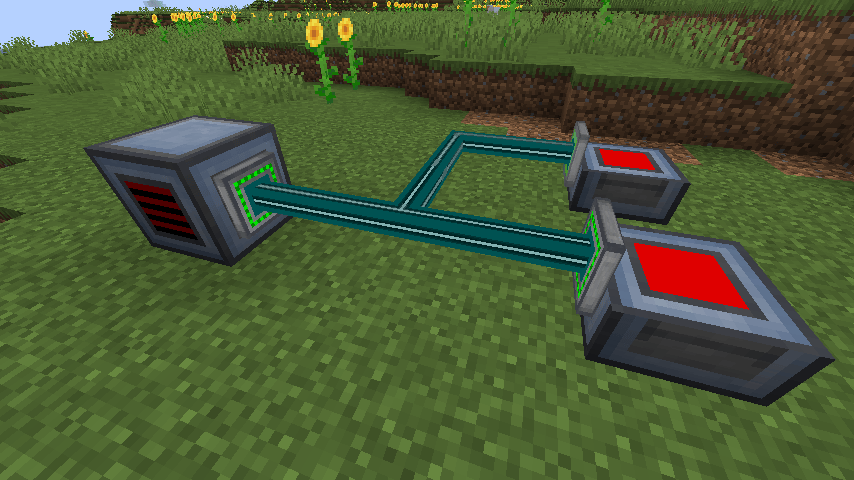
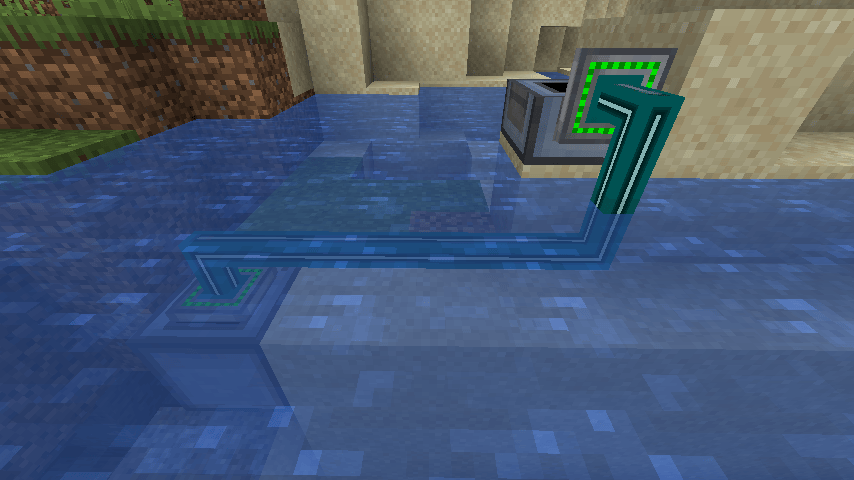

# Episode 5

## Links

* Video: todo
* [Back to 1.20 Tutorial Index](./1.20.md)
* [Tutorial GitHub](https://github.com/McJty/Tut4_3Power)
* Tag for this episode: todo

## Introduction

This tutorial continues on episode 4. In that episode we added a power generator and also a block
that will consume power. You can already let the generator give power to the charger if you place
them next to each other. However, we don't have a way to transport power over a distance yet.
In this tutorial we will add a simple cable system that can transport power from any generator
or battery to any machine that needs power. This is not a perfect cable system. It is just a
simple system that will work for our purposes. We want to be able to place the cables in water
(waterlogging).

* Baked models
* Custom model loader
* Complex block shape
* Waterlogging

## Baked models

It would be possible to make a cable system with a simple json based block model. However, this is
going to generate a lot of combinations and in the future we want our model to also mimic other blocks
which is something you can't do with json models. So we are going to use baked models. This is a
system where we can generate models in code. This is a bit more work but it is also more flexible.




### Block

A cable is also a block so we need to add a new block class for it. We will call it `CableBlock`.
There is a lot going on in this code so we will split it in a few parts.

First there are the properties that indicate if there is a cable or a block in a certain direction:

```java
public class CableBlock extends Block implements SimpleWaterloggedBlock, EntityBlock {

    // Properties that indicate if there is the same block in a certain direction.
    public static final EnumProperty<ConnectorType> NORTH = EnumProperty.<ConnectorType>create("north", ConnectorType.class);
    public static final EnumProperty<ConnectorType> SOUTH = EnumProperty.<ConnectorType>create("south", ConnectorType.class);
    public static final EnumProperty<ConnectorType> WEST = EnumProperty.<ConnectorType>create("west", ConnectorType.class);
    public static final EnumProperty<ConnectorType> EAST = EnumProperty.<ConnectorType>create("east", ConnectorType.class);
    public static final EnumProperty<ConnectorType> UP = EnumProperty.<ConnectorType>create("up", ConnectorType.class);
    public static final EnumProperty<ConnectorType> DOWN = EnumProperty.<ConnectorType>create("down", ConnectorType.class);

```


```java
    private static VoxelShape[] shapeCache = null;

    private static final VoxelShape SHAPE_CABLE_NORTH = Shapes.box(.4, .4, 0, .6, .6, .4);
    private static final VoxelShape SHAPE_CABLE_SOUTH = Shapes.box(.4, .4, .6, .6, .6, 1);
    private static final VoxelShape SHAPE_CABLE_WEST = Shapes.box(0, .4, .4, .4, .6, .6);
    private static final VoxelShape SHAPE_CABLE_EAST = Shapes.box(.6, .4, .4, 1, .6, .6);
    private static final VoxelShape SHAPE_CABLE_UP = Shapes.box(.4, .6, .4, .6, 1, .6);
    private static final VoxelShape SHAPE_CABLE_DOWN = Shapes.box(.4, 0, .4, .6, .4, .6);

    private static final VoxelShape SHAPE_BLOCK_NORTH = Shapes.box(.2, .2, 0, .8, .8, .1);
    private static final VoxelShape SHAPE_BLOCK_SOUTH = Shapes.box(.2, .2, .9, .8, .8, 1);
    private static final VoxelShape SHAPE_BLOCK_WEST = Shapes.box(0, .2, .2, .1, .8, .8);
    private static final VoxelShape SHAPE_BLOCK_EAST = Shapes.box(.9, .2, .2, 1, .8, .8);
    private static final VoxelShape SHAPE_BLOCK_UP = Shapes.box(.2, .9, .2, .8, 1, .8);
    private static final VoxelShape SHAPE_BLOCK_DOWN = Shapes.box(.2, 0, .2, .8, .1, .8);

    public CableBlock() {
        super(Properties.of()
                .strength(1.0f)
                .sound(SoundType.METAL)
                .noOcclusion()
        );
        makeShapes();
        registerDefaultState(defaultBlockState().setValue(WATERLOGGED, false));
    }

    @Nullable
    @Override
    public BlockEntity newBlockEntity(BlockPos blockPos, BlockState blockState) {
        return new CableBlockEntity(blockPos, blockState);
    }

    @Nullable
    @Override
    public <T extends BlockEntity> BlockEntityTicker<T> getTicker(Level level, BlockState state, BlockEntityType<T> type) {
        if (level.isClientSide) {
            return null;
        } else {
            return (lvl, pos, st, be) -> {
                if (be instanceof CableBlockEntity cable) {
                    cable.tickServer();
                }
            };
        }
    }

    private int calculateShapeIndex(ConnectorType north, ConnectorType south, ConnectorType west, ConnectorType east, ConnectorType up, ConnectorType down) {
        int l = ConnectorType.values().length;
        return ((((south.ordinal() * l + north.ordinal()) * l + west.ordinal()) * l + east.ordinal()) * l + up.ordinal()) * l + down.ordinal();
    }

    private void makeShapes() {
        if (shapeCache == null) {
            int length = ConnectorType.values().length;
            shapeCache = new VoxelShape[length * length * length * length * length * length];

            for (ConnectorType up : ConnectorType.VALUES) {
                for (ConnectorType down : ConnectorType.VALUES) {
                    for (ConnectorType north : ConnectorType.VALUES) {
                        for (ConnectorType south : ConnectorType.VALUES) {
                            for (ConnectorType east : ConnectorType.VALUES) {
                                for (ConnectorType west : ConnectorType.VALUES) {
                                    int idx = calculateShapeIndex(north, south, west, east, up, down);
                                    shapeCache[idx] = makeShape(north, south, west, east, up, down);
                                }
                            }
                        }
                    }
                }
            }

        }
    }

    private VoxelShape makeShape(ConnectorType north, ConnectorType south, ConnectorType west, ConnectorType east, ConnectorType up, ConnectorType down) {
        VoxelShape shape = Shapes.box(.4, .4, .4, .6, .6, .6);
        shape = combineShape(shape, north, SHAPE_CABLE_NORTH, SHAPE_BLOCK_NORTH);
        shape = combineShape(shape, south, SHAPE_CABLE_SOUTH, SHAPE_BLOCK_SOUTH);
        shape = combineShape(shape, west, SHAPE_CABLE_WEST, SHAPE_BLOCK_WEST);
        shape = combineShape(shape, east, SHAPE_CABLE_EAST, SHAPE_BLOCK_EAST);
        shape = combineShape(shape, up, SHAPE_CABLE_UP, SHAPE_BLOCK_UP);
        shape = combineShape(shape, down, SHAPE_CABLE_DOWN, SHAPE_BLOCK_DOWN);
        return shape;
    }

    private VoxelShape combineShape(VoxelShape shape, ConnectorType connectorType, VoxelShape cableShape, VoxelShape blockShape) {
        if (connectorType == ConnectorType.CABLE) {
            return Shapes.join(shape, cableShape, BooleanOp.OR);
        } else if (connectorType == ConnectorType.BLOCK) {
            return Shapes.join(shape, Shapes.join(blockShape, cableShape, BooleanOp.OR), BooleanOp.OR);
        } else {
            return shape;
        }
    }

    @Nonnull
    @Override
    public VoxelShape getShape(@Nonnull BlockState state, @Nonnull BlockGetter world, @Nonnull BlockPos pos, @Nonnull CollisionContext context) {
        ConnectorType north = getConnectorType(world, pos, Direction.NORTH);
        ConnectorType south = getConnectorType(world, pos, Direction.SOUTH);
        ConnectorType west = getConnectorType(world, pos, Direction.WEST);
        ConnectorType east = getConnectorType(world, pos, Direction.EAST);
        ConnectorType up = getConnectorType(world, pos, Direction.UP);
        ConnectorType down = getConnectorType(world, pos, Direction.DOWN);
        int index = calculateShapeIndex(north, south, west, east, up, down);
        return shapeCache[index];
    }

    @Override
    public void neighborChanged(BlockState state, Level level, BlockPos pos, Block block, BlockPos fromPos, boolean isMoving) {
        super.neighborChanged(state, level, pos, block, fromPos, isMoving);
        if (!level.isClientSide && level.getBlockEntity(pos) instanceof CableBlockEntity cable) {
            cable.markDirty();
        }
    }

    @Override
    public void setPlacedBy(@Nonnull Level level, @Nonnull BlockPos pos, @Nonnull BlockState state, @Nullable LivingEntity placer, @Nonnull ItemStack stack) {
        super.setPlacedBy(level, pos, state, placer, stack);
        if (!level.isClientSide && level.getBlockEntity(pos) instanceof CableBlockEntity cable) {
            cable.markDirty();
        }
        BlockState blockState = calculateState(level, pos, state);
        if (state != blockState) {
            level.setBlockAndUpdate(pos, blockState);
        }
    }

    @Override
    protected void createBlockStateDefinition(@Nonnull StateDefinition.Builder<Block, BlockState> builder) {
        super.createBlockStateDefinition(builder);
        builder.add(WATERLOGGED, NORTH, SOUTH, EAST, WEST, UP, DOWN);
    }

    @Nonnull
    @Override
    public BlockState updateShape(BlockState state, @Nonnull Direction direction, @Nonnull BlockState neighbourState, @Nonnull LevelAccessor world, @Nonnull BlockPos current, @Nonnull BlockPos offset) {
        if (state.getValue(WATERLOGGED)) {
            world.getFluidTicks().schedule(new ScheduledTick<>(Fluids.WATER, current, Fluids.WATER.getTickDelay(world), 0L));   // @todo 1.18 what is this last parameter exactly?
        }
        return calculateState(world, current, state);
    }

    @Nullable
    @Override
    public BlockState getStateForPlacement(BlockPlaceContext context) {
        Level world = context.getLevel();
        BlockPos pos = context.getClickedPos();
        return calculateState(world, pos, defaultBlockState())
                .setValue(WATERLOGGED, world.getFluidState(pos).getType() == Fluids.WATER);
    }

    @Nonnull
    private BlockState calculateState(LevelAccessor world, BlockPos pos, BlockState state) {
        ConnectorType north = getConnectorType(world, pos, Direction.NORTH);
        ConnectorType south = getConnectorType(world, pos, Direction.SOUTH);
        ConnectorType west = getConnectorType(world, pos, Direction.WEST);
        ConnectorType east = getConnectorType(world, pos, Direction.EAST);
        ConnectorType up = getConnectorType(world, pos, Direction.UP);
        ConnectorType down = getConnectorType(world, pos, Direction.DOWN);

        return state
                .setValue(NORTH, north)
                .setValue(SOUTH, south)
                .setValue(WEST, west)
                .setValue(EAST, east)
                .setValue(UP, up)
                .setValue(DOWN, down);
    }

    @Nonnull
    @Override
    public FluidState getFluidState(BlockState state) {
        return state.getValue(WATERLOGGED) ? Fluids.WATER.getSource(false) : super.getFluidState(state);
    }

    // Return the connector type for the given position and facing direction
    private ConnectorType getConnectorType(BlockGetter world, BlockPos connectorPos, Direction facing) {
        BlockPos pos = connectorPos.relative(facing);
        BlockState state = world.getBlockState(pos);
        Block block = state.getBlock();
        if (block instanceof CableBlock) {
            return ConnectorType.CABLE;
        } else if (isConnectable(world, connectorPos, facing)) {
            return ConnectorType.BLOCK;
        } else {
            return ConnectorType.NONE;
        }
    }

    // Return true if the block at the given position is connectable to a cable. This is the
    // case if the block supports forge energy
    public static boolean isConnectable(BlockGetter world, BlockPos connectorPos, Direction facing) {
        BlockPos pos = connectorPos.relative(facing);
        BlockState state = world.getBlockState(pos);
        if (state.isAir()) {
            return false;
        }
        BlockEntity te = world.getBlockEntity(pos);
        if (te == null) {
            return false;
        }
        return te.getCapability(ForgeCapabilities.ENERGY).isPresent();
    }
}
```



