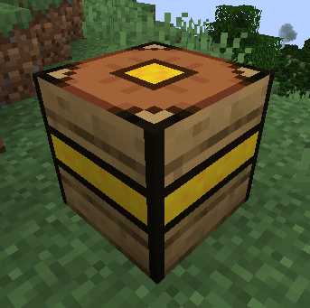
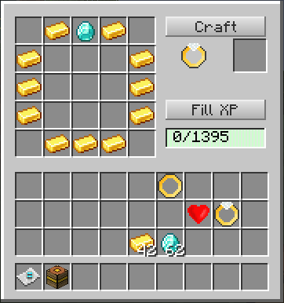

# Experience Crafter

## Introduction



The Experience Crafter is a 5x5 crafting device that can also use XP in order to
determine the bonus effects on crafted trinkets.



## Essence items

You can use the following essence items in your recipes if you want:

*  Blaze Essence
*  Chicken Essence
*  Dragon Essence
*  Enderman Essence
*  Ghast Essence
*  Iron Golem Essence
*  Skeleton Essence
*  Spider Essence
*  Wither Essence
*  Wither Skeleton Essence
*  Zombie Essence


## Defining recipes

**Location**: `data/<modid>/recipes/`

To specify a recipe for the Experience Crafter you have to use the `fancytrinkets:xprecipe` recipe
type.

Example recipe:

```json
{
  "type": "fancytrinkets:xprecipe",
  "key": {
    "S": {
      "type": "forge:partial_nbt",
      "item": "fancytrinkets:gold_ring",
      "nbt": "{id:\"fancytrinkets:base_gold_ring\"}"
    },
    "f": {
      "item": "fancytrinkets:iron_golem_essence"
    },
    "g": {
      "item": "fancytrinkets:blaze_essence"
    },
    "t": {
      "item": "minecraft:ghast_tear"
    }
  },
  "pattern": [
    "gfgfg",
    "ftgtf",
    "ggSgg",
    "ftgtf",
    "gfgfg"
  ],
  "result": {
    "item": "fancytrinkets:gold_ring",
    "nbt": {
      "id": "fancytrinkets:fireresist_ring"
    }
  }
}
```