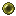
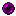
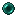

# Trinkets

## Introduction

Trinkets are the actual items that the player can see and use in game.
They will be assocated with a set of effects and one of the built-in
trinket items.

## Details

**Location**: `data/<modid>/fancytrinkets/trinkets`

Trinkets are based on one of the given trinket items that are available in this mod
(note, it's possible for other mods to provide their own trinkets using a
capability. More on that in another chapter)

The following items are supported (add `fancytrinkets:` in front to get the full ID
to use in the trinket description):

*  `gold_ring`
*  `gold_ring_blue`
*  `gold_ring_green`
*  `gold_ring_red`
*  `gold_ring_diamond`
*  `silver_ring`
*  `silver_ring_blue`
*  `silver_ring_green`
*  `silver_ring_red`
*  `silver_ring_diamond`
*  `obsidian_ring`
*  `obsidian_ring_diamond`
*  `star`
*  `heart`
*  `heart_body`
*  `feather`
*  `black_pearl`
*  `blue_pearl`
*  `yellow_pearl`
*  `purple_pearl`
*  `shiny_pearl`
*  `leather_belt`
*  `blue_belt`
*  `charm1`
*  `charm2`


### General syntax

The general syntax for a trinket is as follows:

```json
{
  "bonustable": "<bonustable id>",          // Reference to the bonus table (see later)
  "description": "<description key>",       // A language key for the description of this trinket
  "name": "<name key>>",                    // A language key for the name of this trinket
  "item": "<item id>",                      // One of the supported trinket items (see above)
  "effects": [                              // A list of effects
    {
      "hidden": false,                      // If this effect visible in tooltip or not
      "id": "<effect id>"                   // The id of the effect to use
    },
    ...
  ]
}
```

The bonustable represents the set of effects that you can get when crafting this trinket
(depending on the experience inserted into the Experience Crafter). More on bonus tables
in [Bonus Tables](./bonus-tables.md).

### Examples

Here is an example for a simple regeneration ring:

```json
{
  "bonustable": "fancytrinkets:standard",
  "description": "trinket.fancytrinkets.regeneration_ring.description",
  "item": "fancytrinkets:gold_ring_diamond",
  "name": "trinket.fancytrinkets.regeneration_ring.name",
  "effects": [
    {
      "hidden": false,
      "id": "fancytrinkets:regeneration"
    }
  ]
}
```

And here an example of a more advanced trinkets with multiple effects:

```json
{
  "bonustable": "fancytrinkets:standard",
  "description": "trinket.fancytrinkets.power_star.description",
  "item": "fancytrinkets:star",
  "name": "trinket.fancytrinkets.power_star.name",
  "effects": [
    {
      "hidden": false,
      "id": "fancytrinkets:attack_range"
    },
    {
      "hidden": false,
      "id": "fancytrinkets:attack_speed"
    },
    {
      "hidden": false,
      "id": "fancytrinkets:attack_damage"
    },
    {
      "hidden": false,
      "id": "fancytrinkets:reach_distance"
    }
  ]
}
```

## Default trinkets

There are lot of default trinkets already included with the mod. You can find all of them
here (https://github.com/McJtyMods/FancyTrinkets/tree/1.19/src/generated/resources/data/fancytrinkets/fancytrinkets/trinkets). Here is a list:

* `base_star`:  Crafting ingredient to make star trinkets
* `flight_star`: This star gives you the freedom of flight
* `power_star`: You feel the power surging through you!
* `swift_star`: Feel the freedom of swift and flexible movement
* `slowfalling_feather`: Gravity seems to have less effect on you
* `base_gold_ring`:  Crafting ingredient to make golden ring trinkets
* `lightness_ring`: Reduce 75% of fall damage
* `fireresist_ring`: Ring of Coolness", "Reduce all heat related damage (100%)
* `nightvision_ring`: Night Vision", "Using a hotkey you can see clearly in the dark
* `stepassist_ring`: You can move around much easier now
* `base_heart`:  Crafting ingredient to make heart trinkets
* `super_health`: You feel so much more healthy now
* `cure`: Negative effects can't harm you
* `base_gold_ring_diamond`:  Crafting ingredient to make golden ring trinkets (with diamond)
* `absorption_ring`: Provides some damage absorption
* `regeneration_ring`: Slowly get your health back
* `strength_ring`: Your attacks seem to have more effect
* `warp_pearl`: Warp Pearl
