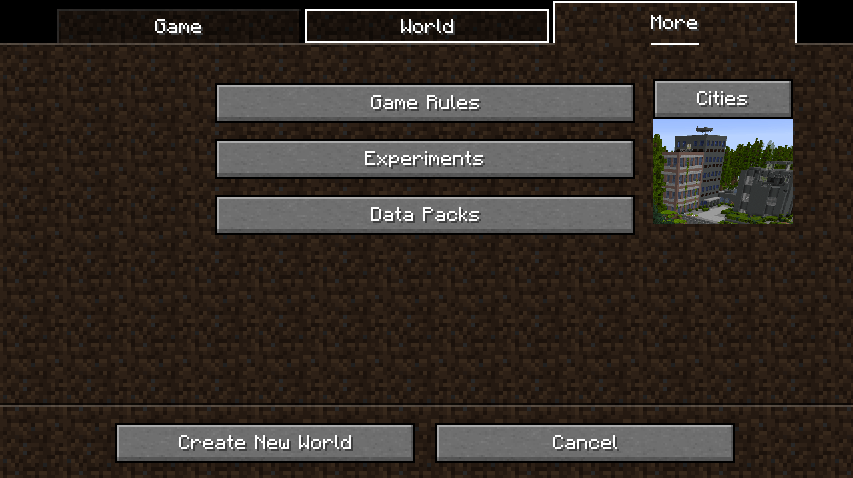
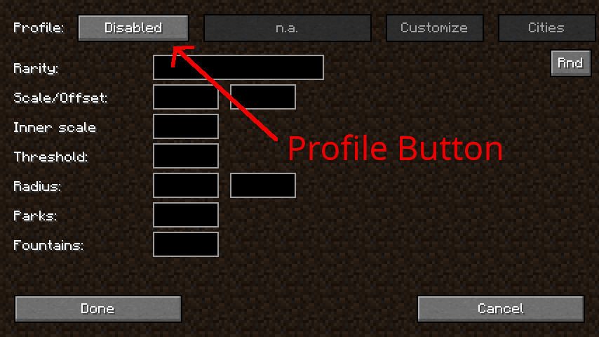
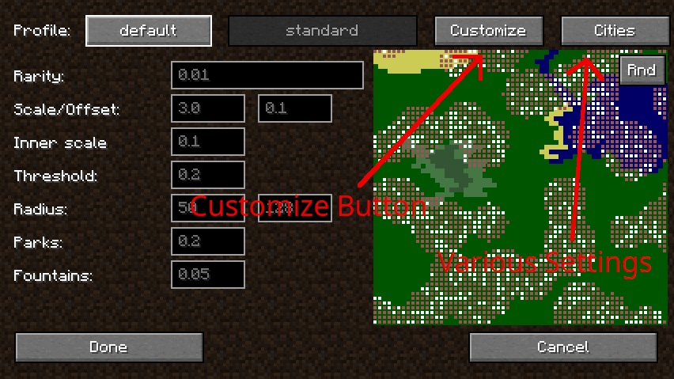
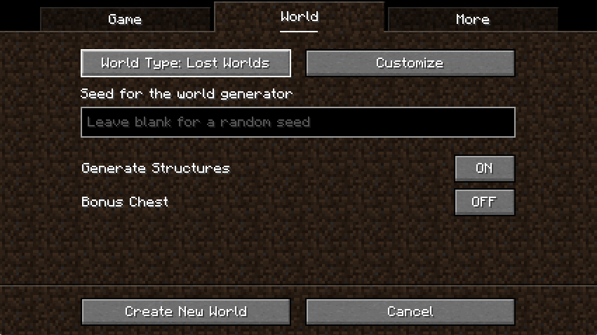
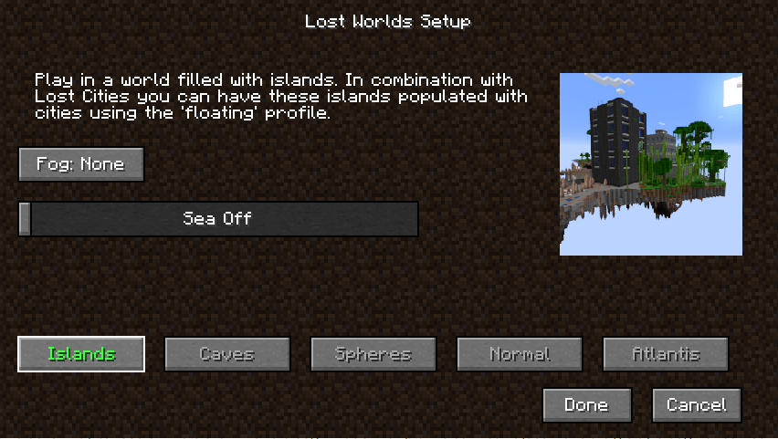

# Lost Cities and Lost Worlds

Lost Cities is a world generation mod. Lost Worlds is a companion mod that adds two new world
types that can be used in conjuction with Lost Cities. In this chapter both mods are explained.

This documentation is mostly relevant for Minecraft 1.18.2 or later. Lost Worlds is only available
on Minecraft 1.20.1 or later.

You can find the documentation for older versions here:
[The Lost Cities Legacy](./lost-cities/lost-cities-legacy.md)

## Introduction

**Lost Cities** has two major functionalities:

* You can configure it to add cities to the overworld. It should be compatible with most world types
* It also adds a new dimension ('lostcities:lostcity') that you can travel to from within a normal overworld (or from another Lost City world)

Here is a gallery with screenshots:

[Gallery](https://minecraft.curseforge.com/projects/the-lost-cities/images)

**Lost Worlds** is a companion mod that adds two new world presets (Lost Worlds and Lost Worlds (Wastes)).
With these world types you can generate a few different types of worlds:

* **Islands**: this is a void world with floating islands. In combination with Lost Cities you can populate these islands with cities (use the 'floating' profile for that)
* **Caves**: this is a world similar to the nether but with regular stone and ores. You can use this in combination with the 'cavern' profile for Lost Cities. Warning! This is very hard. It may be recommended to use a spawn chest to help get started
* **Spheres**: this is a void world that you can use in combination with the 'space' profile for Lost Cities. This will generate spheres which may contain cities
* **Normal**: this is a normal style world that can be used in combination with the Lost Cities 'biosphere' profile. This is best used in combination with the 'Wastes' version of the world preset
* **Atlantis**: this is a normal style world that can be used in combination with the Lost Cities 'atlantis' profile. The sea will be at height 90

With the fog button you can configure the fog color for the overworld.
The sea slider allows you to configure the sea level. This is only relevant for the _Islands_ and
_Spheres_ world types. For the other world types the sea level is fixed.

## How to use

### Lost Cities Single Player

When creating a world go to the tab where you can do extra configuration and there you press the _Cities_ button:



Using the profile button you can choose between different profiles. These profiles control the style of the cities that are generated.



It is also possible to further customize the cities by pressing the _Customize_ button:



Using that button you can configure the style of the cities, the amount of cities, the distance between cities, the height of the buildings,
how much damage there is and so on.

After you have configured the world you can press the _Done_ button and continue with creating the world.

### Lost Cities Multiplayer

The easiest way to configure Lost Cities for multiplayer is to first configure it for single player and then copy the
_lostcities-server.toml_ file that you can find in your created single player world (_saves/&lt;yourworld&gt;/serverconfig/lostcities-server.toml_)
to the server _defaultconfigs_ directory BEFORE creating the world there.

:::danger Warning
It is NOT needed to copy the entire single player world to the server. Only the _lostcities-server.toml_ file is needed
:::

If you want to configure the world on the server itself then you can do that by editing the _lostcities-server.toml_ file.

Note, if you don't want to first create a single player world then you can also configure the server
by placing a _lostcities-server.toml_ file in the _defaultconfigs_ directory. Here is an example of how that
would look like:

```toml
#General settings
[profiles]
	#Block to put underneath a bed so that it qualifies as a teleporter bed
	specialBedBlock = "minecraft:diamond_block"
	selectedProfile = "profile"
	selectedCustomJson = ""
```

### Lost Worlds Single Player

While Lost Cities adds cities to whatever world type that you created it doesn't actually modify how the world itself is generated.
The Lost Worlds mod adds two new world types that you can use to generate worlds that are more suitable for Lost Cities.

To select this world type you need to go to the _World_ options tab and then select the _Lost Worlds_ world type:



There is also a second world type called _Lost Worlds (Wastes)_. This is similar to the _Lost Worlds_ world type but it has a different
biome distribution. Many biomes are replaced with more wasteland-like biomes (deserts, badlands, gravelly mountains, etc).

It's also possible to customize the world type by pressing the _Customize_ button. This will open a screen where you can configure
this world type:



The five possible types are:

* **Islands**: this is a void world with floating islands. In combination with Lost Cities you can populate these islands with cities (use the 'floating' profile for that)
* **Caves**: this is a world similar to the nether but with regular stone and ores. You can use this in combination with the 'cavern' profile for Lost Cities. Warning! This is very hard. It may be recommended to use a spawn chest to help get started
* **Spheres**: this is a void world that you can use in combination with the 'space' profile for Lost Cities. This will generate spheres which may contain cities
* **Normal**: this is a normal style world that can be used in combination with the Lost Cities 'biosphere' profile. This is best used in combination with the 'Wastes' version of the world preset
* **Atlantis**: this is a normal style world that can be used in combination with the Lost Cities 'atlantis' profile. The sea will be at height 90

With the fog button you can configure the fog color for the overworld.
The sea slider allows you to configure the sea level. This is only relevant for the _Islands_ and
_Spheres_ world types. For the other world types the sea level is fixed.

Note that selecting a world type will automatically select the corresponding profile for Lost Cities. You
can still change this later if you want.

### Lost Worlds Multiplayer

When you want to configure Lost Worlds on a server you first have to follow the steps to configure
Lost Cities on a server. Make sure to pick the profile that is compatible with the world type that
you want to use.

After that the only thing you have to do is to configure the world type itself. This can be done
by editing the _server.properties_ file and changing this line:

```
level-type=lostworlds\:lost_worlds
```
Make sure you have a new world (delete the 'world' directory if needed) and the server should use
the default lost worlds type (which corresponds to floating islands).

#### Using another Lost Worlds type 

Using another Lost Worlds type is possible but a bit more complicated. Lost Worlds comes with
three more world types:

* _lostworlds:lost_worlds_caves_
* _lostworlds:lost_worlds_spheres_
* _lostworlds:lost_worlds_atlantis_ 

To use these you have to make a small datapack that adds the desired world type to the right tag. For
example. Let's say you want to make a caves type world. You'll have to do the following things:

* Setup Lost Cities for a 'cavern' style world (see above in the multiplayer section of Lost Cities)
* Edit _server.properties_ and change the _level-type_ to _lostworlds:lost_worlds_caves_
* Make a datapack to add the lost_worlds_caves preset to the tag.

To do this last step you first have to make sure you have a _world_ folder that is empty.
In that folder you then create a _datapacks_ folder and in that folder you create a folder
for your datapack (can have any name you want).
You then create the _pack.mcmeta_ file in that folder:

```mcmeta
{
  "pack": {
    "pack_format": 10,
    "description": "New world preset"
  }
}
```

In addition you create the folder _data/minecraft/tags/worldgen/world_preset_ and in that folder
create the _normal.json_ file with the following contents:

```json
{
  "values": [
    "lostworlds:lost_worlds_caves"
  ]
}
```

Then also create an _extended.json_ file with exactly the same contents.

If you followed all these steps correctly then you should be able to start the server and it will
use the caves world type.

## Basic Structure

This page is mostly about the internal structure and configuration about the mod.
In this first section the basic operation of the mod is explained.

The buildings, bridges, subway system, fountains and other structures you find in the world are actually not structures but real worldgen.
That means that are generated at the very first stage when a chunk is built.
This makes generation very efficient and also allows it to fit much better when the surrounding world.

It is important to note that this mod cannot depend on any specific order of chunk generation.
When generating a chunk it cannot depend on neighbouring chunks already being generated, so it has to be able to calculate things on its own.
Nevertheless, this mod maintains several world-wide data structures and is able to query information about nearby chunks without actually having to generate the chunk.

Read about it here: [Basic Structure](./structure.md)


## The Asset System

The asset system is a powerful system that you can customize to make your own buildings, decorations, control loot, mob spawners, building blocks and more.
Read about it here: [Asset DataPack System](./asset-datapack.md)
